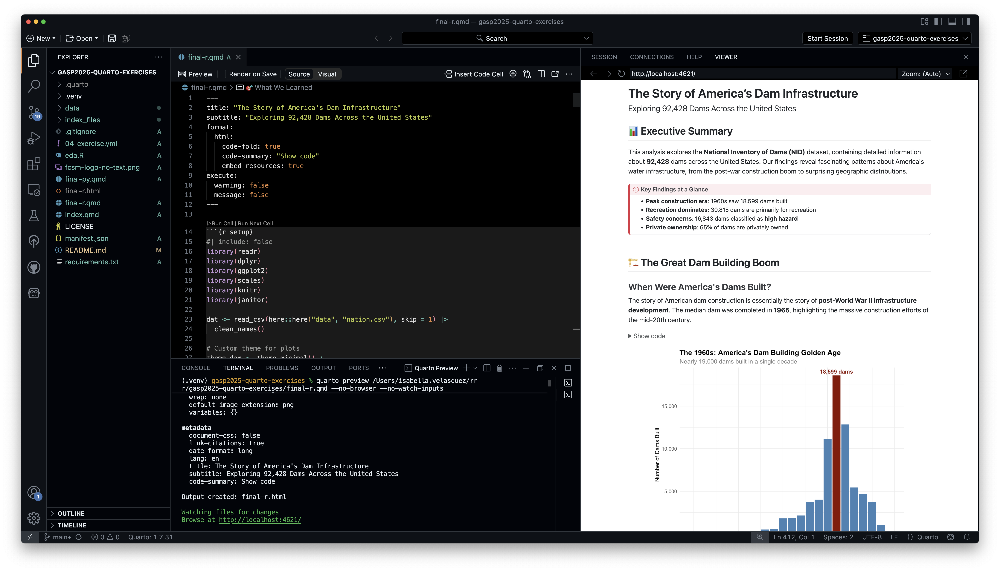
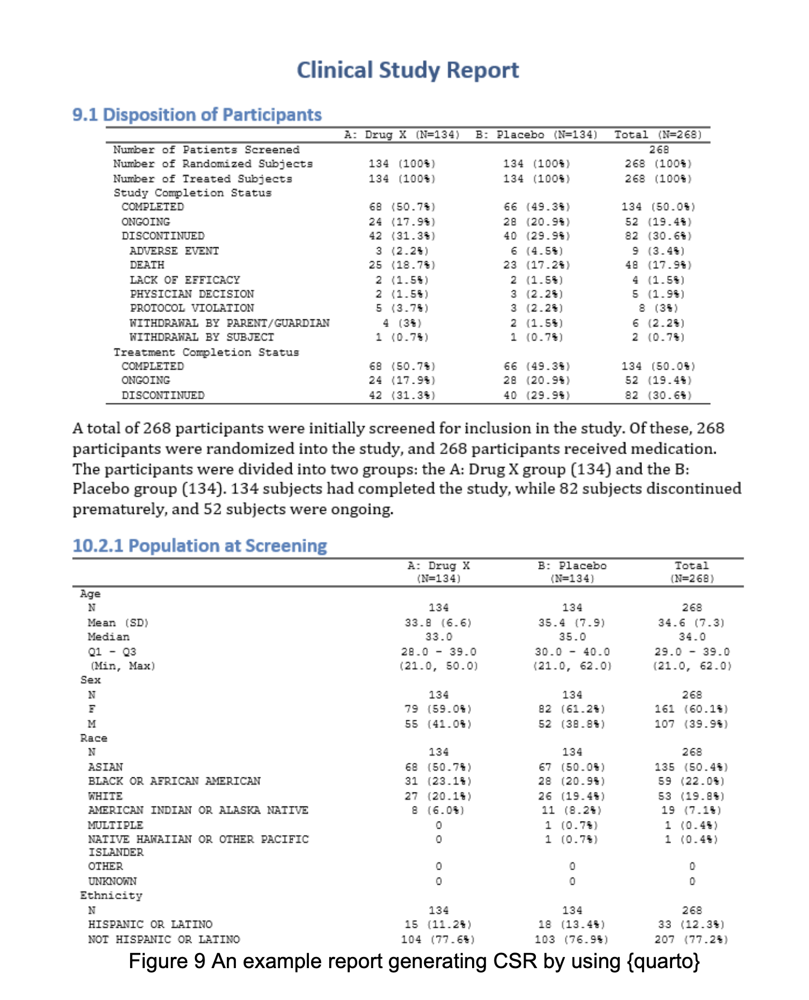
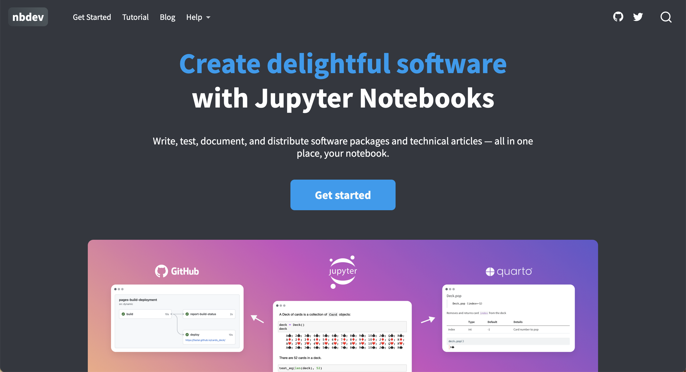
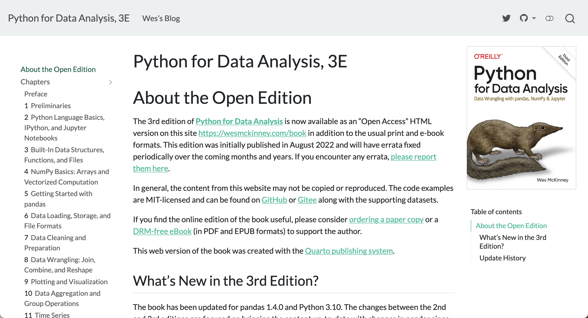
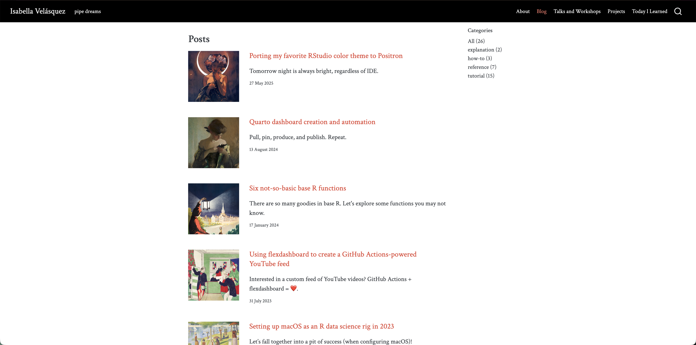
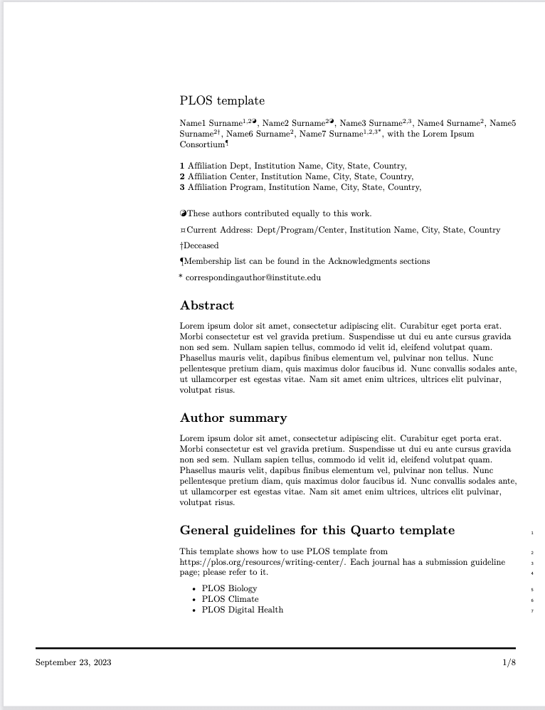
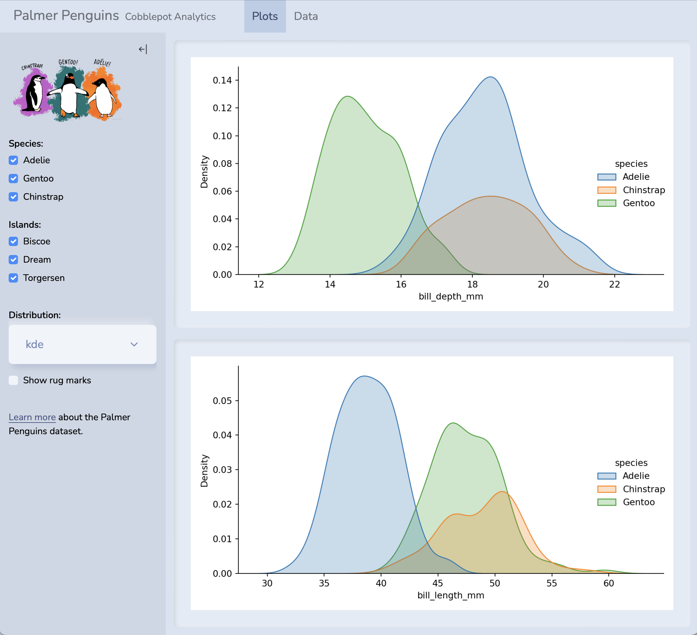
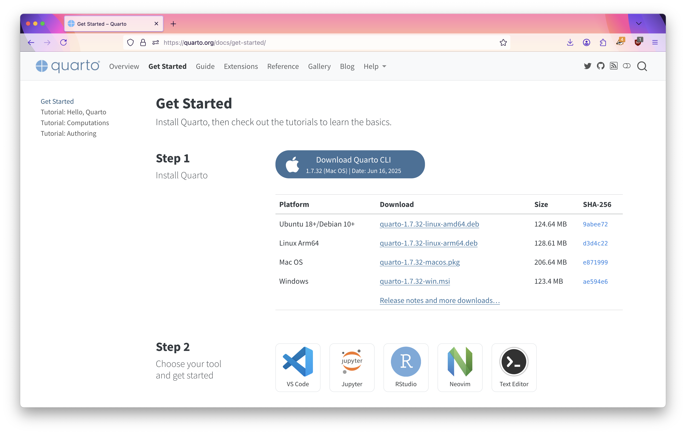
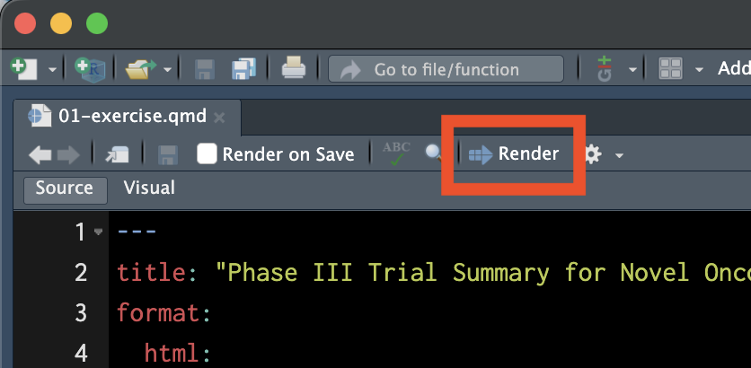
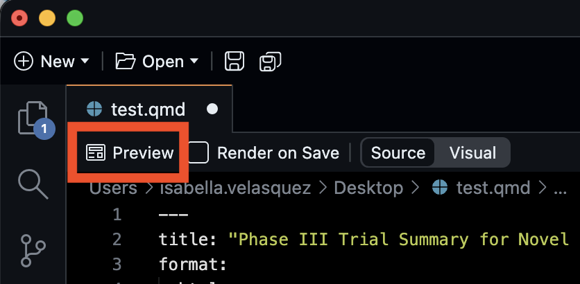

# Welcome

## About me

<center>


[ ivelasq](https://github.com/ivelasq)

[ ivelasq](https://www.linkedin.com/in/ivelasq/)

[ ivelasq.rbind.io](https://ivelasq.rbind.io)

[ ivelasq3](https://bsky.app/profile/ivelasq3.bsky.social)
</center>

## About you

::: your-turn
Please share in the chat...

- Your name
- Your professional affiliation
- What you produce with data (reports, dashboards, etc.)
- What programming language you use
:::

## About this workshop

::::::: columns
:::: {.column width="50%"}
::: {.fragment .fade-in-then-semi-out}
These materials are pitched at someone who:

* knows some R
* has R installed
* creates documents that display output from code
* new to Markdown and Quarto
:::
::::

:::: {.column width="50%"}
::: {.fragment .fade-in}

What you will walk away with:

* An introductory knowledge of Quarto and its benefits of telling stories with data
* A working knowledge of theming documents
* Examples of documents with code
:::
::::
:::::::

## Workshop structure

::::::: columns
::: {.column .fragment width="33%"}
**My turn**

-   Lecture segments
-   Feel free to just watch, take notes, browse docs, or tinker around with the code
:::

:::: {.column .fragment width="33%"}
::: our-turn
**Our turn**

-   Lecture segments + live coding
-   (Optionally) Follow along with live coding
:::
::::

:::: {.column .fragment width="33%"}
::: your-turn
**Your turn**

- Practice exercises for you!
- Ask questions in the chat if you run into issues
:::
::::
::::::::

## Instructions

::: incremental

* Workshop website: [bit.ly/rnvsu-quarto](https://bit.ly/rnvsu-quarto])
* Workshop exercise repo: <https://github.com/ivelasq/rnvsu-quarto-exercises>

:::

# Introduction to Quarto

## What is Quarto®? {auto-animate="true"}

<center>

Quarto® is an

::: {.fragment .grow .semi-fade-out}
open-source
:::

::: {.fragment .grow .semi-fade-out}
scientific and technical
:::

::: {.fragment .grow .semi-fade-out}
publishing system
:::

::: {.fragment .grow .semi-fade-out}
built on Pandoc.
:::

</center>

::: notes
Quarto is an open-source scientific and technical publishing system built on Pandoc. Let's break this down: Open-source: Posit believes that it's better for everyone if the tools used for research and science are free and open. Free software means more reproducibility, widespread sharing of knowledge and techniques, and elimination of cost barriers. Scientific and technical: Scientific and technical means that Quarto has specific things for journal articles or scientific papers, like support for code execution, citations, footnotes, scientific markdown, equations, citations, crossrefs, so many things. Publishing system: Quarto is a tool for writing dynamic documents that combine code, output, and text. It can embed output from Python, R, Julia, and Observable. Quarto can be rendered to create high-quality articles, reports, presentations, websites, blogs, and books in HTML, PDF, MS Word, ePub, and more formats. Pandoc is the tool working behind the scenes to change Quarto documents to their finalized format. Quarto documents are authored with markdown, which is a plain text format. But Pandoc markdown is very rich and lets you control your document in very specific ways while being easy to read and write.
:::


## With Quarto...

you can weave together narrative and code to produce elegantly formatted output as documents, web pages, blog posts, books and more.

::: incremental
-   Create dynamic content with Python, R, Julia, and Observable
-   Edit documents in your favorite editor
-   Publish technical content in HTML, PDF, MS Word, and more
-   Share technical content by publishing to Posit Connect, Confluence, or other publishing systems
:::

## "Literate programming"

{fig-align="center"}

::: notes
Quarto sits inside the big and broad literate programming world, which mixes narrative in text form with code for formatted outputs like documents and webpages and more. There are lots of literate programming systems that support computation, like R Markdown, Org Mode, Jupyter Book, and now there is Quarto!
:::

## How does Quarto work?

{fig-align="center"}

::: footer


Artwork from “Hello, Quarto” keynote by Julia Lowndes and Mine Çetinkaya-Rundel, presented at RStudio::Conf(2022). Illustrated by Allison Horst.

:::

## Why Quarto?

::: incremental
- Multilingual and independent of computational systems
- Quarto comes **"batteries included"** straight out of the box
- Consistent expression for core features
- Extension system
- Enable “single-source publishing” — create Word, PDFs, HTML, etc. from one source
- Use defaults that meet accessibility guidelines
:::

::: notes
So, if there already exist literate programming tools out there, why create a new one? Like mentioned earlier, Quarto was built from the start to support multiple computational systems and ecosystems. You can create presentations, books, websites, and so on after installing Quarto, you do not have to install other tools to create different things. Consistent expression for core features means that regardless of whether you are making a presentation, book, or website, the syntax is written same way. And for things that aren't part of base Quarto, there are extensions that can add further functionality. Single-source publishing, you often need to create all sorts of output, like things that are printed, on the web, on the mobile. The idea is to being able to make publications from one source. And the Quarto team thinks deeply about accessibility and how to have Quarto default to meet accessibility guidelines.
:::

## What can you build with Quarto? {.smaller}

::: panel-tabset
### Docs

[Generate Clinical Study Report (CSR) document using {quarto} and {shiny}](https://www.lexjansen.com/phuse-us/2025/os/PAP_OS06.pdf) presented at PHUSE US Connect 2025 by CIMS Global

[{fig-align="center" width="60%" style="box-shadow: 5px 5px 15px rgba(0, 0, 0, 0.3); border-radius: 5px;"}](https://www.lexjansen.com/phuse-us/2025/os/PAP_OS06.pdf)

### Sites

[nbdev.fast.ai](https://nbdev.fast.ai){preview-link="true"}

[{fig-align="center" width="60%" style="box-shadow: 5px 5px 15px rgba(0, 0, 0, 0.3); border-radius: 5px;"}](https://nbdev.fast.ai)

### Books

[Python for Data Analysis, 3E by Wes McKinney](https://wesmckinney.com/book/){preview-link="true"}

[{fig-align="center" width="60%" style="box-shadow: 5px 5px 15px rgba(0, 0, 0, 0.3); border-radius: 5px;"}](https://wesmckinney.com/book/)

### Blogs

[My blog](https://ivelasq.rbind.io){preview-link="true"}

[{fig-align="center" width="60%" style="box-shadow: 5px 5px 15px rgba(0, 0, 0, 0.3); border-radius: 5px;"}](https://ivelasq.rbind.io)

### Presentations

[The untold story of palmerpenguins by Dr. Kristen Gorman, Dr. Allison Horst, and
Dr. Alison Hill](https://allisonhorst.github.io/talks/useR_2022/){preview-link="true"}

[{height="400" style="box-shadow: 5px 5px 15px rgba(0, 0, 0, 0.3); border-radius: 5px;" fig-align="center"}](https://allisonhorst.github.io/talks/useR_2022/)

### Journals

[Quarto template for Public Library of Science](https://github.com/quarto-journals/plos){preview-link="true"}

[{height="400" fig-align="center" style="box-shadow: 5px 5px 15px rgba(0, 0, 0, 0.3); border-radius: 5px;"}](https://christophertkenny.com/posts/2023-07-01-creating-quarto-journal-articles/)

### Dashboards

[Penguins dashboard](https://jjallaire.shinyapps.io/penguins-dashboard/){preview-link="true"}

[{fig-align="center" width="60%" style="box-shadow: 5px 5px 15px rgba(0, 0, 0, 0.3); border-radius: 5px;"}](https://jjallaire.shinyapps.io/penguins-dashboard/)

:::

:::: {.fragment .tabswitch}
:::

:::: {.fragment .tabswitch}
:::

:::: {.fragment .tabswitch}
:::

:::: {.fragment .tabswitch}
:::

:::: {.fragment .tabswitch}
:::

:::: {.fragment .tabswitch}
:::

:::: {.fragment .tabswitch}
:::

## Quarto capabilities {.smaller}

Built for technical documents:

* Cross references
* Advanced layout
* Figure/layout panels
* Callouts
* Diagrams
* Extensions
* Interactivity
* YAML intelligence
* Publishing
* Conditional content
* Notebook filters

::: notes
Features are constantly being build into Quarto, like YAML intelligence, figure panels, layouts, which we'll cover later in the session.
:::

## ️Wrap up {background-image="../images/quarto-chat.jpg" background-color="#2b3d5b"}

Quarto + Data = ❤

::: footer
Photo by <a href="https://unsplash.com/@kellysikkema?utm_content=creditCopyText&utm_medium=referral&utm_source=unsplash">Kelly Sikkema</a> on <a href="https://unsplash.com/photos/two-white-speech-bubbles-sitting-on-top-of-a-brown-surface-sWRPYgjpygQ?utm_content=creditCopyText&utm_medium=referral&utm_source=unsplash">Unsplash</a>
:::

# Getting started

## Installation

{width=80% fig-align="center"}

::: aside
[quarto.org/docs/get-started/](https://quarto.org/docs/get-started/)
:::

::: notes
You can download the Quarto Command Line Interface, or CLI, on quarto.org. When you download the Quarto CLI, though, that's all you need to run Quarto, so you can use just your Terminal or Command Line Interface for everything that we'll explore, but you will need to install a programming language if you're going to run code with the CLI.
:::

## Tools for authoring

::: {layout-ncol="3" align="center"}

{width="160"}

{width="160"}

{width="160"}

{width="160"}

{width="160"}

:::

```{.bash filename="Terminal"}
quarto render
```

::: notes
Part of the multilingualism of Quarto is that you are not tied to one tool. Quarto is meant for collaboration either within data science teams or across data science teams. So if someone is familiar with VS Code, but someone else likes to work in RStudio, they can still work on the same Quarto documents without having to switch to one tool or the other.
:::

## Our turn {background-color=''}

Let's walk through your options for today.

::: incremental

1. Posit Cloud
1. Local installation
:::

::: notes
Posit Cloud has R, RStudio, Quarto, packages, installed. You just need a free account. But I will delete in a few days. If you prefer Python, there is a GitHub Codespace. It takes many minutes to load so please open it up as soon as you can if you'd like to go this route. The packages will not come preinstalled, but the instructions are on the website. Finally, you can always install Positron, RStudio, or VS Code locally, but you will also need R or Python installed. You'll also have to install the packages and download the repo materials. So, if you do not have these set up, I recommend going with Posit Cloud or GitHub Codespace for now, and coming back to the materials after the workshop.
:::

## Your turn {background-color=''}

Go to the workshop website and click on `00 - Introduction` in the sidebar.

<br>

<center>[bit.ly/rnvsu-quarto](https://bit.ly/rnvsu-quarto])</center>

<br>

Follow the setup instructions at the bottom.



::: footer
[Posit Cloud link: posit.cloud/content/12393384](posit.cloud/content/12393384)
:::

## Our turn: Quarto workflow {background-color=''}

* Open a `.qmd` file.
* Preview/render the document.
* Make a change and preview/render again.

::::: columns
:::: {.column width="40%"}
{style="box-shadow: 5px 5px 15px rgba(0, 0, 0, 0.3); border-radius: 5px;"}
::::

:::: {.column width="40%"}
{ style="box-shadow: 5px 5px 15px rgba(0, 0, 0, 0.3); border-radius: 5px;"}
::::
:::::

## Your turn {background-color=''}





::: footer
[Posit Cloud link: posit.cloud/content/12393384](posit.cloud/content/12393384)
:::
