# Anatomy of a Quarto document

## Anatomy of a Quarto document {.smaller}

`.qmd` file format with three components:

1.  YAML: Metadata

2.  Text: Markdown

3.  Code: R, Python, Observable, and Julia

. . .

**Weave it all together**, and you have beautiful, powerful, and useful outputs!

::: notes
A Quarto document contains three types of content: a YAML header, code chunks, and markdown text.
:::

## Anatomy of a Quarto document {.smaller}

**Metadata: YAML**

````{.markdown filename="report.qmd"}
---
title: "Electricity Generation in the Philippines"
format: html
---
````

## Anatomy of a Quarto document {.smaller}

**Metadata: YAML**

:::: columns
::: {.column}

````{.markdown filename="report.qmd"}
---
title: "Electricity Generation in the Philippines"
format: html
---
````

:::

::: {.column}
* "Yet another markup language”
* Metadata of your document
* Demarcated by three dashes (`---`) on either end
*  Uses key-value pairs in the format `key: value`
:::

::::

::: notes
Quarto documents usually start with an (optional) YAML header demarcated by three dashes on either end. The basic syntax of YAML uses key-value pairs in the format key: value. It controls the output of the document and contain metadata for your document. YAML fields commonly found in headers of documents include metadata like author, subtitle, date as well as customization options like theme, fontcolor, fig-width, etc.
:::

## Anatomy of a Quarto document {.smaller}

**Text: Markdown**

````{.markdown filename="report.qmd"}
---
title: "Electricity Generation in the Philippines"
format: html
---

Electricity generation in the Philippines achieved superior response and survival outcomes 
with a statistically significant p-value for Overall 
Survival (p = 0.003) and a favorable Hazard Ratio (0.65).
````

. . .

* Markdown is a lightweight language for creating formatted text
* Quarto is based on Pandoc and uses its variation of markdown as its underlying document syntax

::: notes
Markdown is a lightweight markup language for creating formatted text using a plain-text editor. Quarto uses markdown syntax for text.
:::

## Anatomy of a Quarto document

**Text: Markdown**

+-----------------------------------+-------------------------------+
| Markdown syntax                   | Output                        |
+===================================+===============================+
|     *italics* and **bold**        | *italics* and **bold**        |
+-----------------------------------+-------------------------------+
|     superscript^2^ / subscript~2~ | superscript^2^ / subscript~2~ |
+-----------------------------------+-------------------------------+
|     ~~strikethrough~~             | ~~strikethrough~~             |
+-----------------------------------+-------------------------------+
|     `verbatim code`               | `verbatim code`               |
+-----------------------------------+-------------------------------+

## Anatomy of a Quarto document

**Text: Markdown**

```{=html}
<div class="sourceCode">
<pre class="sourceCode markdown">
<code class="sourceCode markdown">
Electricity **generation** in the `Philippines`
</code>
</pre>
</div>
```

Results in:

Electricity **generation** in the `Philippines`

## Anatomy of a Quarto document

**Code**

````{.markdown filename="report.qmd" code-line-numbers=|10-15}
---
title: "Electricity Generation in the Philippines"
format: html
---

Coal has dominated Philippine electricity generation 
throughout the period, but renewables have grown steadily.


```{{r}}
gt() |>
  fmt_number(columns = c(`Min (GWh)`, `Max (GWh)`, `Latest (GWh)`), decimals = 0) |>
  tab_header(title = "Historical Generation Summary by Source (GWh)")
```
````

## Anatomy of a Quarto document

**Code**

:::: columns
::: {.column}

````{.markdown filename="report.qmd" code-line-numbers=10-15}
---
title: "Electricity Generation in the Philippines"
format: html
---

Coal has dominated Philippine electricity generation 
throughout the period, but renewables have grown steadily.

```{{r}}
gt() |>
  fmt_number(columns = c(`Min (GWh)`, `Max (GWh)`, `Latest (GWh)`), decimals = 0) |>
  tab_header(title = "Historical Generation Summary by Source (GWh)")
```
````

:::

::: {.column}
* Code chunks begin and end with three backticks (usually)
* Code chunks are identified with a programming language in between `{}`
:::

::::

::: notes
Code chunks are identified with three backticks, the language in curly brackets, and can have optional chunk options identified by the hashpipe at the beginning of the line within the chunk.
:::

## Anatomy of a Quarto document

**Code** can include optional chunk options, in YAML style, identified by `#|` at the beginning of the line

````{.markdown code-line-numbers=10}
---
title: "Electricity Generation in the Philippines"
format: html
---

Coal has dominated Philippine electricity generation 
throughout the period, but renewables have grown steadily.

```{{r}}
#| echo: false
gt() |>
  fmt_number(columns = c(`Min (GWh)`, `Max (GWh)`, `Latest (GWh)`), decimals = 0) |>
  tab_header(title = "Historical Generation Summary by Source (GWh)")
```
````

::: notes
Code chunks can have optional chunk options identified by the hashpipe at the beginning of the line within the chunk.
:::

## Anatomy of a Quarto document

+--------------+------------------------------------------------+
| Option       | Description                                    |
+==============+================================================+
| `eval`       | Evaluate the code chunk                        |
+--------------+------------------------------------------------+
| `echo`       | Include the source code                        |
+--------------+------------------------------------------------+
| `warning`    | Include warnings                               |
+--------------+------------------------------------------------+
| `include`    | Include code and results                       |
+--------------+------------------------------------------------+

Other options: <https://quarto.org/docs/computations/execution-options.html>

## Anatomy of a Quarto document

**Inline code** executes code *within Markdown*

````{.markdown filename="report.qmd"}
```{{r}}
share = 26
```

Renewable energy has increased to `r scales::percent(share)`.
````

Results in:

Renewable energy has increased to 26%.

## Your turn  {background-color='' .smaller}
  




::: footer
[Posit Cloud link: posit.cloud/content/12393384](posit.cloud/content/12393384)
:::

# Authoring Quarto

## Images and links

+------------------------------------+---------------------------------+
| Markdown syntax                    | Output                          |
+====================================+=================================+
|     <https://quarto.org>           | <https://quarto.org>            |
+------------------------------------+---------------------------------+
|     [Quarto](https://quarto.org)   | [Quarto](https://quarto.org)    |
+------------------------------------+---------------------------------+
|                |             |
+------------------------------------+---------------------------------+

## Tables  {.small auto-animate="true"}

``` {{markdown}}
| Right | Left | Default | Center |
|------:|:-----|---------|:------:|
|    12 | 12   | 12      |   12   |
|   123 | 123  | 123     |  123   |
|     1 | 1    | 1       |   1    |
```

| Right | Left | Default | Center |
|------:|:-----|---------|:------:|
|    12 | 12   | 12      |   12   |
|   123 | 123  | 123     |  123   |
|     1 | 1    | 1       |   1    |

## Tables  {.small auto-animate="true"}

``` {{markdown}}
| Right | Left | Default | Center |
|------:|:-----|---------|:------:|
|    12 | 12   | 12      |   12   |
|   123 | 123  | 123     |  123   |
|     1 | 1    | 1       |   1    |

: Table Column Widths {tbl-colwidths="[10,30,30,30]"}
```

| Right | Left | Default | Center |
|------:|:-----|---------|:------:|
|    12 | 12   | 12      |   12   |
|   123 | 123  | 123     |  123   |
|     1 | 1    | 1       |   1    |

: Table Column Widths {tbl-colwidths="\[10,30,30,30\]"}

## Diagrams

```{mermaid}
%%| fig-width: 6
%%| echo: fenced
flowchart LR
  A[1] --> B(2)
  B --> C{3}
  C --> D[4]
  C --> E[5]
```

::: notes
There is also native support for diagrams, where the syntax is similar as R or Python where the execution is being run by Quarto. This is a Mermaid diagram, which is a newer project supported on GitHub where you can use it in their documents as well, so it's a pretty handy tool to get to know.
:::

## Equations

``` {{markdown}}
$$E = mc^{2}$$
```

$$E = mc^{2}$$

::: notes
Math mode in LaTeX
:::

## Divs and Spans

**Divs**

    ::: {.border}
    This content can be styled with a border
    :::
    
**Spans**

    [This is *some text*]{.class key="val"}

[This is *some text*]{.class key="val"}

::: notes
For furture customization, you can add classes, attributes, and other identifiers to content using Divs and Spans. Some are built into Quarto, and you can define your own, as well.
:::

## Divs

**Callout blocks**

```{.markdown filename="report.qmd"}
:::{.callout-tip}

Note that there are five types of callouts, including: 
`note`, `tip`, `warning`, `caution`, and `important`.

:::
```

. . .

::: callout-tip
Note that there are five types of callouts, including: `note`, `tip`, `warning`, `caution`, and `important`.
:::

## Divs

**Multiple columns**

```{.markdown filename="report.qmd"}
::: {layout-ncol=2}


Photo by <a href="https://unsplash.com/@_louisreed?utm_source=unsplash&utm_medium=referral&utm_content=creditCopyText">Louis Reed</a> on <a href="https://unsplash.com/photos/refill-of-liquid-on-tubes-pwcKF7L4-no?utm_source=unsplash&utm_medium=referral&utm_content=creditCopyText">Unsplash</a>
:::
```

. . .

::: {layout-ncol="2"}


Photo by <a href="https://unsplash.com/@_louisreed?utm_source=unsplash&utm_medium=referral&utm_content=creditCopyText">Louis Reed</a> on <a href="https://unsplash.com/photos/refill-of-liquid-on-tubes-pwcKF7L4-no?utm_source=unsplash&utm_medium=referral&utm_content=creditCopyText">Unsplash</a>
:::


## Divs

**Tabsets**

```{.markdown filename="report.qmd"}
::: {.panel-tabset group="language"}
## R

`library(dplyr)`

## Python

`import pandas as pd`
:::
```

::: {.panel-tabset group="language"}
## R

`library(dplyr)`

## Python

`import pandas as pd`
:::


:::: {.fragment .tabswitch}
:::

:::: {.fragment .tabswitch}
:::

## Spans

```{.markdown filename="report.qmd"}
This is text that is [red]{style="color:red;"}.
```

This is text that is [red]{style="color:red;"}.

. . .

```{.markdown filename="report.qmd"}
{fig-alt="Philippines beach"}
```

{fig-alt="Philippines beach"}

::: notes
You can also apply styles to inline text by creating spans. Use square brackets to surround the text and curly bracketes for the style you would like.
:::

# Changing formats

## Changing formats

````{.markdown code-line-numbers=3 filename="report.qmd"}
---
title: "Electricity Generation in the Philippines"
format: html
---
````

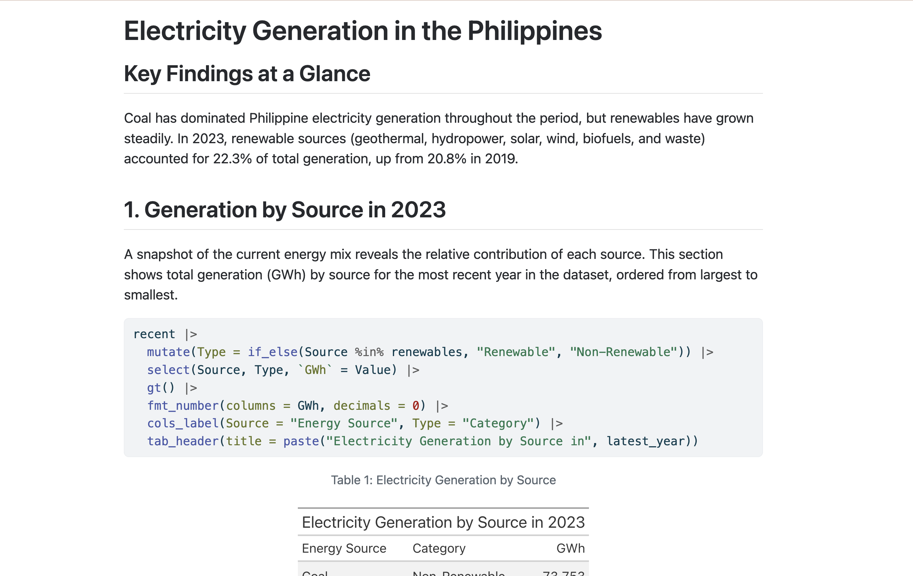{fig-align="center" width=50% style="box-shadow: 5px 5px 15px rgba(0, 0, 0, 0.3); border-radius: 5px;"}

## Changing formats

````{.markdown code-line-numbers=3 filename="report.qmd"}
---
title: "Electricity Generation in the Philippines"
format: revealjs
---
````

{fig-align="center" width=50% style="box-shadow: 5px 5px 15px rgba(0, 0, 0, 0.3); border-radius: 5px;"}

## Changing formats

````{.markdown code-line-numbers=3 filename="report.qmd"}
---
title: "Phase III Trial Summary for Novel Oncology Agent (Drug X)"
format: typst
---
````

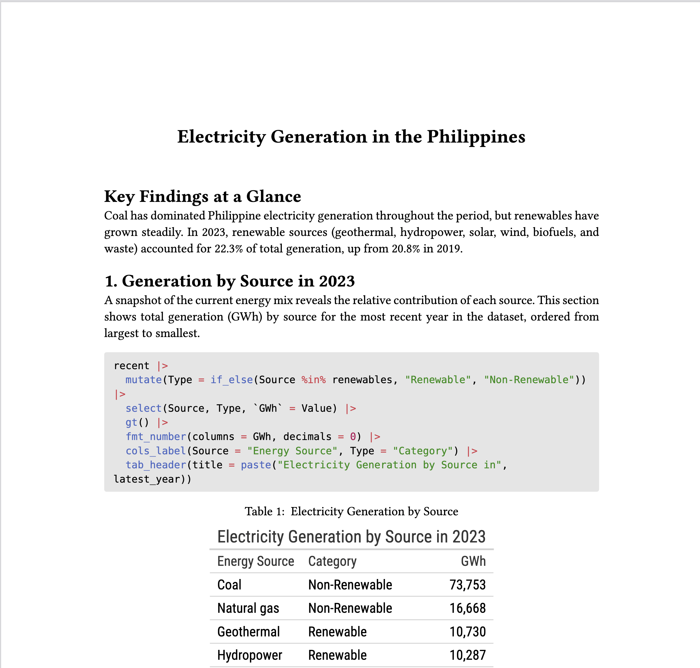{fig-align="center" width=50% style="box-shadow: 5px 5px 15px rgba(0, 0, 0, 0.3); border-radius: 5px;"}

# Presentations with reveal.js

## reveal.js

reveal.js presentations allow you to create stunning presentations on the web.

* Present code and LaTeX equations
* Include computations in slide output
* Add image, video, and iFrame backgrounds
* Add fancy transitions and animations
* Activate scroll view

…and much more

::: notes
What makes reveal.js so cool? It's all about creating stunning, modern presentations that live on the web. It's fantastic for technical presentations because it handles code and LaTeX equations beautifully. You can even include live computations and interactive content directly in your slides. It also supports fancy transitions, animations, and a unique scroll view for long-form content, allowing you to create engaging and dynamic presentations for any topic. 
:::

## Structure {auto-animate=true}

:::: {.columns}

::: {.column width="40%"}

````{.markdown}
---
title: "Habits"
author: "John Doe"
format: html
---

## Getting up

- Turn off alarm
- Get out of bed

## Going to sleep

- Get in bed
- Count sheep
````
:::

::: {.column width="60%"}

```{=html}
<iframe src="./_example-01.html" width="100%" height="500"></iframe>
```

:::

::::

::: notes
On the left, we have a basic Quarto document with two sections. On the right, you can see how it's rendered as a simple HTML document. This is what you'd get by default if you set the format to html.
:::

## Structure {auto-animate=true}

:::: {.columns}

::: {.column width="40%"}

````{.markdown code-line-numbers=4}
---
title: "Habits"
author: "John Doe"
format: revealjs
---

## Getting up

- Turn off alarm
- Get out of bed

## Going to sleep

- Get in bed
- Count sheep
````
 
:::

::: {.column width="60%"}

```{=html}
<iframe src="./_example-02.html" width="100%" height="500"></iframe>
```

:::

::::

::: notes
Now, let's change the format to revealjs in the YAML header. See the difference on the right? The same content is now formatted as a slide deck, with each top-level heading (##) becoming a new slide. This demonstrates the core principle of Quarto presentations: you write your content, and Quarto formats it for you.
:::

## Structure {auto-animate=true}

:::: {.columns}

::: {.column width="40%"}

````markdown
---
title: "Habits"
author: "John Doe"
format: revealjs
---

# In the morning

## Getting up

- Turn off alarm
- Get out of bed

## Breakfast

- Eat eggs
- Drink coffee

# In the evening

## Dinner

- Eat spaghetti
- Drink wine

## Going to sleep

- Get in bed
- Count sheep
````

:::

::: {.column width="60%"}

```{=html}
<iframe src="./_example-03.html" width="100%" height="500"></iframe>
```

:::

::::

::: notes
You can also create a multi-level slide structure. By using a top-level heading (#), you create a new vertical section. Any sub-headings (##) below it will become a vertical sequence of slides. This is a great way to organize your presentation and create logical sections, just like you would with a regular document.
:::

## Structure {auto-animate=true}

:::: {.columns}

::: {.column width="40%"}

````markdown
---
title: "Habits"
author: "John Doe"
format: revealjs
---

- Turn off alarm
- Get out of bed

---

- Get in bed
- Count sheep
````

:::

::: {.column width="60%"}

```{=html}
<iframe src="./_example-04.html" width="100%" height="500"></iframe>
```

:::

::::

::: notes
Here's another way to create a new slide. The horizontal rule (---) acts as a slide break. This is useful for splitting up content on a single page, like a list, into multiple slides.
:::

## Editing slides

The `quarto-revealjs-editable` extension allows for the repositioning and resizing of images and text divs directly in previewed slides.

{fig-align="center"}

::: footer
Learn more: [quarto-revealjs-editable](https://github.com/EmilHvitfeldt/quarto-revealjs-editable)
:::

::: notes
A great tool for fine-tuning your presentation is the quarto-revealjs-editable extension by Emil Hvitfeldt. It allows you to drag and drop text and images right on the slide preview to reposition and resize them. This saves a lot of time by eliminating the need to manually adjust positions in your source code.
:::

## Custom Revealjs formats

::: {layout-ncol=2}

[{width=70% style="box-shadow: 5px 5px 15px rgba(0, 0, 0, 0.3); border-radius: 5px;"}](https://davidcarayon.github.io/Insee-vscode/#/title-slide)

[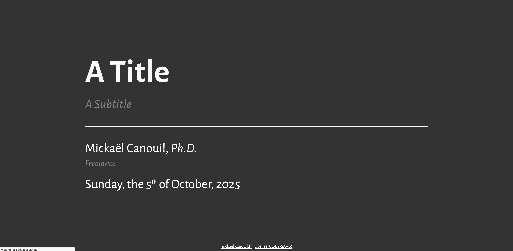{width=70% style="box-shadow: 5px 5px 15px rgba(0, 0, 0, 0.3); border-radius: 5px;"}](https://github.com/mcanouil/quarto-revealjs-coeos)

[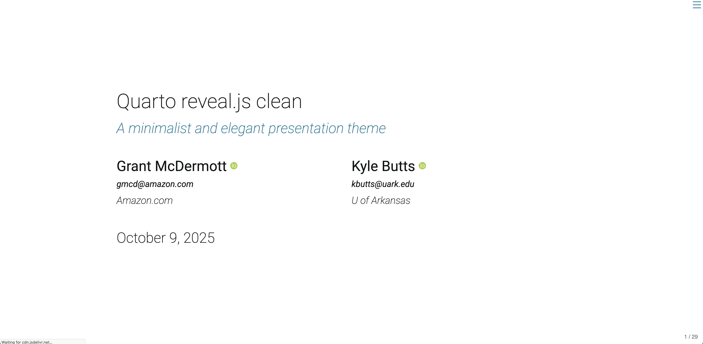{width=70% style="box-shadow: 5px 5px 15px rgba(0, 0, 0, 0.3); border-radius: 5px;"}](https://grantmcdermott.com/quarto-revealjs-clean-demo/template.html#/title-slide)

[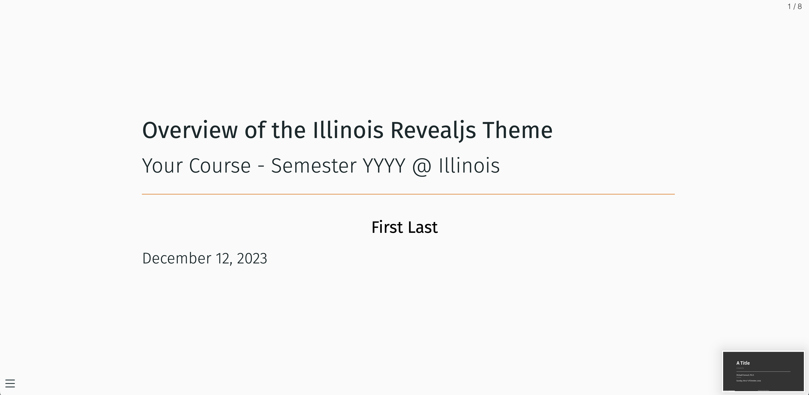{width=70% style="box-shadow: 5px 5px 15px rgba(0, 0, 0, 0.3); border-radius: 5px;"}](https://quarto.thecoatlessprofessor.com/illinois-revealjs/#/title-slide)

:::

# PDFs with Typst

## Typst


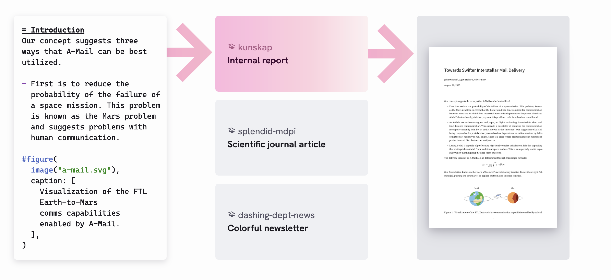{fig-align="center" width="70%"}

::: notes
Typst is a new open-source markup-based typesetting system that is designed to be as powerful as LaTeX while being much easier to learn and use. Typst is built to simplify the process of creating beautiful, professional PDFs. It uses a markup-based system, which means you write plain text and code to define your document's structure and style, just like you would with Quarto or Markdown. 
:::

::: footer
Learn more: [Typst in Quarto](https://quarto.org/docs/output-formats/typst.html)
:::

## Page layout

Control the size of the page (`papersize`), the page margins (`margin`), and the number of columns used for page content (`columns`):

:::: {.columns}

::: {.column width="40%"}


```markdown
---
title: Page Layout
format:
  typst:
    papersize: a5
    margin:
      x: 1cm
      y: 1cm
    columns: 2
---
``` 

:::

::: {.column width="60%"}

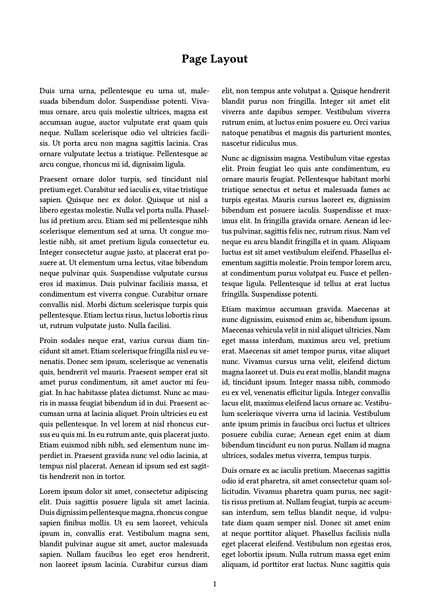{.border width="40%" fig-align="center" fig-alt="Screenshot of one page of PDF document. The document shows a two columns of text. Compared to the previous screenshot, the page is narrower and longer, and the margins are smaller." style="box-shadow: 5px 5px 15px rgba(0, 0, 0, 0.3); border-radius: 5px;"}

:::
::::

::: footer
Learn more: [Page Layout](https://quarto.org/docs/output-formats/typst.html#page-layout)
:::

::: notes
One of the great things about Typst is how easily you can customize your PDF's appearance. You can control the page size, margins, and even the number of columns directly from your YAML. For example, to create a two-column, A5-sized document with one-centimeter margins, you can use this code.
:::

::: notes
If you want more granular control, you can define your margins for the horizontal and vertical directions separately. You can use standard units like inches or centimeters, as shown here.
:::

## Typst blocks

Add a `.block` class to change appearance of blocks:

```markdown
::: {.block fill="luma(230)" inset="8pt" radius="4pt"}

This is a block with gray background and slightly rounded corners.

:::
```

::: footer
Learn more: [Typst Blocks](https://quarto.org/docs/output-formats/typst.html#typst-blocks)
:::

::: notes
Typst also lets you create custom blocks to highlight specific content. You can add a .block class to your markdown and change its appearance with a few simple attributes, like fill, inset, and radius.
:::

## Custom Typst formats

::: {layout-ncol=4}

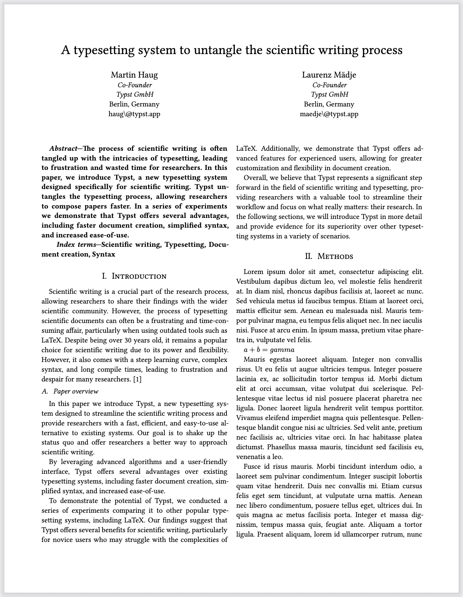{.lightbox group="custom-formats" fig-alt="Screenshot of a page showing a article styled according IEEE standards. The title is centered with authors below in two columns."}

{.lightbox group="custom-formats" fig-alt="Screenshot of a poster in landscape orientiation. The poster includes a logo in the top right, a title in the top left, and content arranged in three columns."}

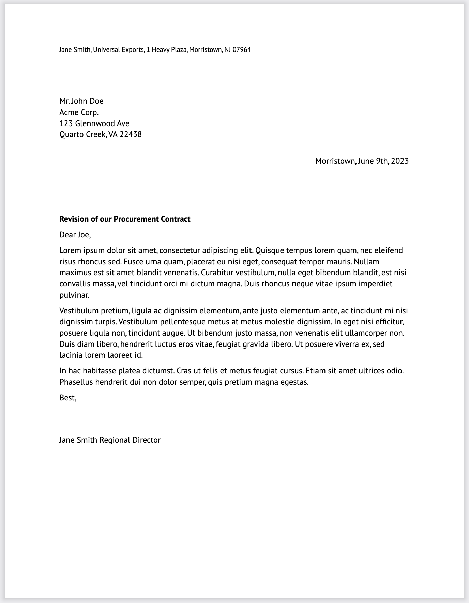{.lightbox group="custom-formats" fig-alt="Screenshot of a page showing a letter. A sender address is across the top of the page, followed by a recipient address left justified. The body of the letter includes a subject line in bold."}

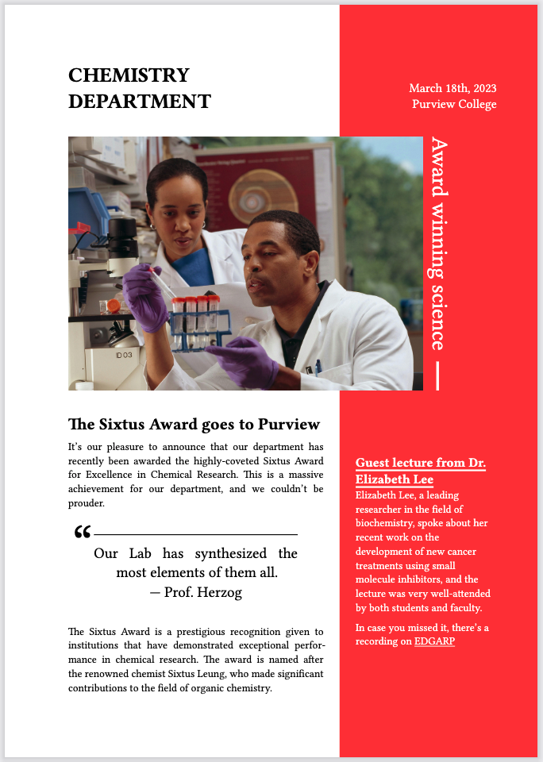{.lightbox group="custom-formats" fig-alt="Screenshot of a page showing a department newsletter. The page is split vertically with a white column on the left and a red one on the right. An image spans across the column with the text \"Award Winning Science\" oriented to run vertically down its right side."}

:::

::: notes
Typst allows you to define your own templates to produce highly customized documents.
:::

::: footer
Learn more: [Custom Typst Formats](https://quarto.org/docs/output-formats/typst-custom.html)
:::

## Your turn {background-color='' .smaller}
  


::: footer
[Posit Cloud link: posit.cloud/content/12393384](posit.cloud/content/12393384)
:::

# Dashboards

## Quarto dashboards {.smaller}

* An output format for creating dashboards from notebooks

. . .

* Publish groups of visualizations, tables, text together

. . .

* Released in Quarto 1.4

. . .

::: {.callout-tip}

Run this command in your terminal to see what version of Quarto you are on:

```{.bash filename=Terminal}
quarto --version
```

:::

## 

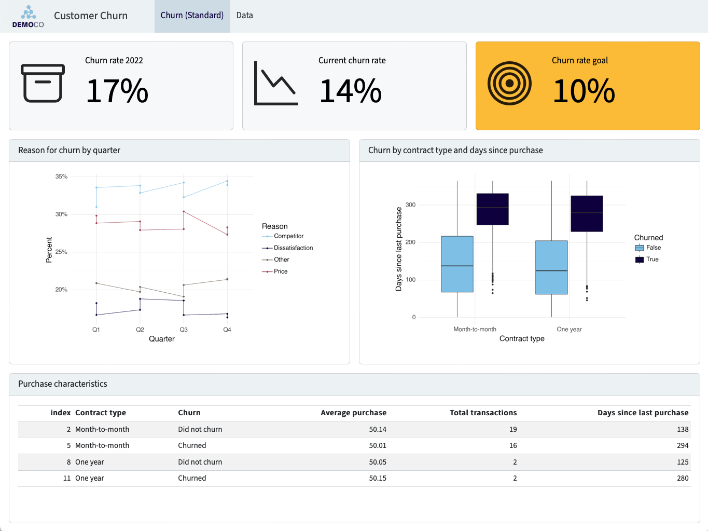{fig-align="center" width="100%" style="box-shadow: 5px 5px 15px rgba(0, 0, 0, 0.3); border-radius: 5px;"}

::: {.notes}
rows and columns
value boxes
multiple pages
:::

##

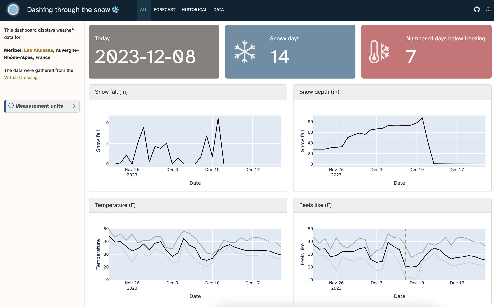{fig-align="center" width="100%" style="box-shadow: 5px 5px 15px rgba(0, 0, 0, 0.3); border-radius: 5px;"}

::: {.notes}
sidebar
:::

## 

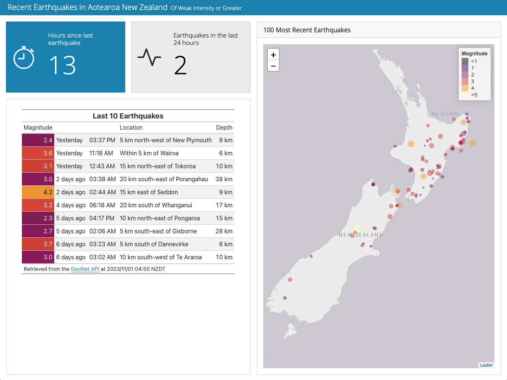{fig-align="center" width="100%" style="box-shadow: 5px 5px 15px rgba(0, 0, 0, 0.3); border-radius: 5px;"}

::: {.notes}
interactive leaflet widget
html widget
:::

## 

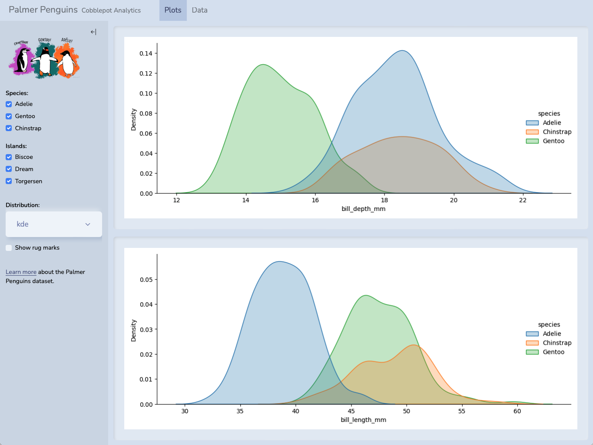{fig-align="center" width="100%" style="box-shadow: 5px 5px 15px rgba(0, 0, 0, 0.3); border-radius: 5px;"}

::: {.notes}
uses shiny for python
select island and penguins and distributions will change
can see all these dashboards and their code on the quarto website under gallery
:::

## Cards {auto-animate="true" auto-animate-easing="ease-in-out"}

Dashboards are composed of **cards**.

::: {.notes}
cards are the basic building blocks of dashboards
you often won't need to manually define a card -- they will typically map to cells in your notebook that create plots, display data, display text, etc.
:::


::: r-hstack
::: {data-id="box1" auto-animate-delay="0" style="background: #73994e; width: 200px; height: 150px; margin: 10px; border: 3px solid #000;"}
:::

::: {data-id="box2" auto-animate-delay="0.1" style="background: #f3c13d; width: 200px; height: 150px; margin: 10px; border: 3px solid #000;"}
:::

::: {data-id="box3" auto-animate-delay="0.2" style="background: #223e50; width: 200px; height: 150px; margin: 10px; border: 3px solid #000;"}
:::
:::

## Rows and columns {auto-animate="true" auto-animate-easing="ease-in-out"}

Cards are arranged into **rows** and **columns**.

::: r-stack
::: {data-id="box1" auto-animate-delay="0" style="background: #73994e; width: 235px; height: 145px; margin-top: 30px; position: absolute; left: 275px; border: 3px solid #000;"}
:::

::: {data-id="box2" style="background: #f3c13d; width: 235px; height: 145px; margin-top: 30px; position: absolute; right: 275px; border: 3px solid #000;"}
:::

::: {data-id="box3" style="background: #223e50; width: 500px; height: 300px; margin-top: 200px; border: 3px solid #000;"}
:::
:::

::: {.notes}
to organize content 
arrange into rows and columns
:::

## Layouts {auto-animate="true" auto-animate-easing="ease-in-out"}

**Pages**, **tabsets**, and **sidebars** allow for more advanced layouts.

::: r-stack
::: {data-id="box1" auto-animate-delay="0" style="background: #73994e; width: 235px; height: 145px; margin-top: 30px; position: absolute; left: 275px; border: 3px solid #000;"}
:::

::: {data-id="box2" style="background: #f3c13d; width: 235px; height: 145px; margin-top: 30px; position: absolute; right: 275px; border: 3px solid #000;"}
:::

::: {data-id="box3" style="background: #223e50; width: 500px; height: 300px; margin-top: 200px; border: 3px solid #000;"}
:::

::: {data-id="box4" auto-animate-delay="0" style="background: #a9c7c9; width: 150px; height: 470px; margin-top: 30px; position: absolute; right: 800px; border: 3px solid #000;"}
:::
:::

::: {.notes}
can also control the general layout of the page with things like pages, tabsets, and sidebars
talk about this in the next slide deck
:::

## Start from Scratch {auto-animate=true}

Begin with front matter:

````{.yaml filename="dashboard.qmd"}
---
title: "My first Quarto dashboard"
format: dashboard
---
````

## Start from Scratch {auto-animate=true}

Add a card:

````{.yaml filename="dashboard.qmd"}
---
title: "My first Quarto dashboard"
format: dashboard
---

```{{r}}
plot(mtcars)
```
````

## Start from Scratch {auto-animate=true}

Add a card:

:::: {.columns}

::: {.column width="40%"}

````{.yaml filename="dashboard.qmd"}
---
title: "My first Quarto dashboard"
format: dashboard
---

```{{r}}
plot(mtcars)
```
````

:::

::: {.column width="60%"}

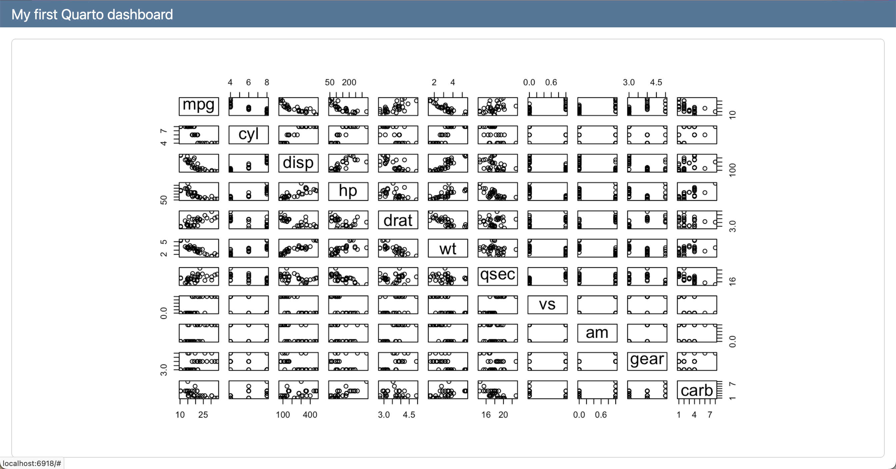

:::
::::

## Start from scratch {auto-animate=true}

Continue adding cards:

:::: {.columns}

::: {.column width="40%"}

````{.yaml filename="dashboard.qmd"}
---
title: "My first Quarto dashboard"
format: dashboard
---

```{{r}}
plot(mtcars)
```

```{{r}}
plot(mtcars$mpg)
```
````

:::


::: {.column width="60%" .fragment}
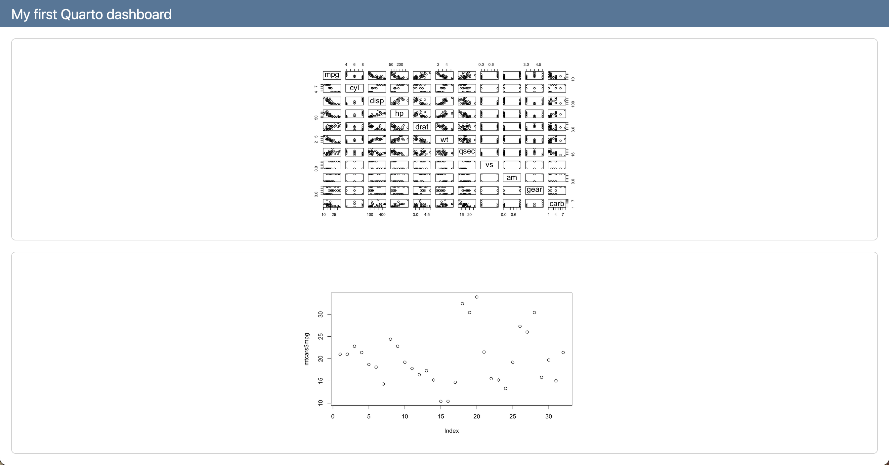
:::
::::

## Start from Scratch {auto-animate=true}

Add a title to your cards:

:::: {.columns}

::: {.column width="40%"}

````{.yaml filename="dashboard.qmd"}
---
title: "My first Quarto dashboard"
format: dashboard
---

```{{r}}
#| title: "Plot 1"
plot(mtcars)
```

```{{r}}
#| title: "Plot 2"
plot(mtcars$mpg)
```
````
:::

::: {.column width="60%"  .fragment}
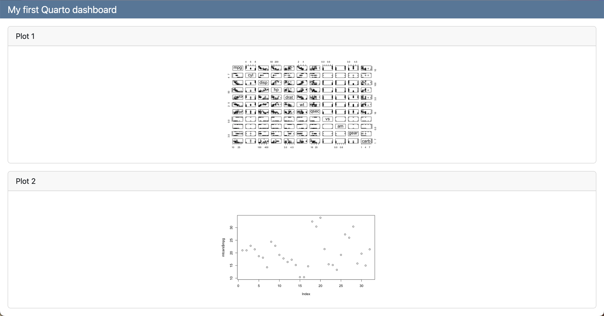
:::

::::

## {auto-animate=true}

{fig-align="center"}

## Rows {auto-animate=true}

By default, cards are laid out in rows:

:::: {.columns}

::: {.column width="40%"}

````{.yaml filename="dashboard.qmd"}
---
title: "My first Quarto dashboard"
format: dashboard
---

```{{r}}
#| title: "Plot 1"
plot(mtcars)
```

```{{r}}
#| title: "Plot 2"
plot(mtcars$mpg)
```
````
:::

::: {.column width="60%"}

:::

::::

## Rows {auto-animate=true}

By default, cards are laid out in rows:

:::: {.columns}

::: {.column width="40%"}

````{.yaml filename="dashboard.qmd"}
---
title: "My first Quarto dashboard"
format: 
  dashboard:
    orientation: rows
---

```{{r}}
#| title: "Plot 1"
plot(mtcars)
```

```{{r}}
#| title: "Plot 2"
plot(mtcars)
```
````
:::

::: {.column width="60%"}

:::

::::

## Columns {auto-animate=true}

We can change it to be columns instead:

:::: {.columns}

::: {.column width="40%"}

````{.yaml filename="dashboard.qmd"}
---
title: "My first Quarto dashboard"
format: 
  dashboard:
    orientation: columns
---

```{{r}}
#| title: "Plot 1"
plot(mtcars)
```

```{{r}}
#| title: "Plot 2"
plot(mtcars$mpg)
```
````
:::

::: {.column width="60%" }
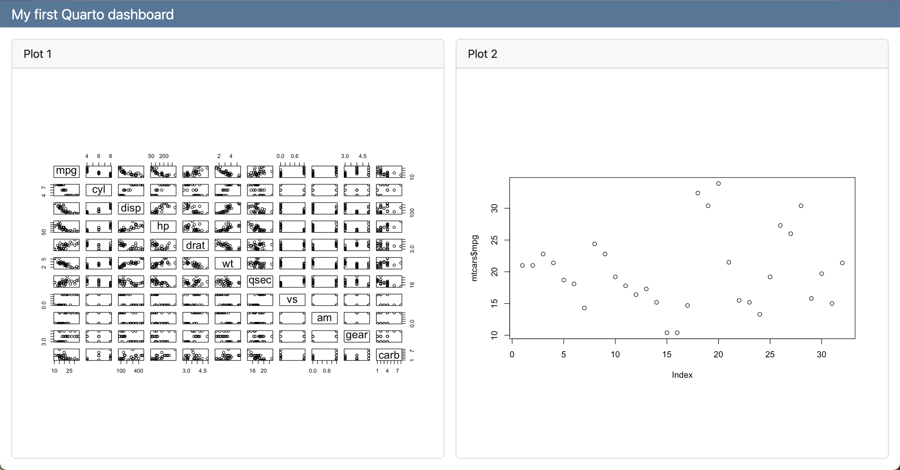
:::

::::

## Headings {auto-animate=true}

Alternatively, we can use headings to arrange cards:

````{.yaml filename="dashboard.qmd" code-line-numbers=8}
---
title: "My first Quarto dashboard"
format: 
  dashboard:
    orientation: rows
---

## Row

```{{r}}
#| title: "Plot 1"
plot(mtcars)
```

```{{r}}
#| title: "Plot 2"
plot(mtcars)
```
````

## Headings {auto-animate=true}

Alternatively, we can use headings to arrange cards:

:::: {.columns}

::: {.column width="40%"}

````{.yaml filename="dashboard.qmd"}
---
title: "My first Quarto dashboard"
format: 
  dashboard:
    orientation: rows
---

## Row

```{{r}}
#| title: "Plot 1"
plot(mtcars)
```

```{{r}}
#| title: "Plot 2"
plot(mtcars)
```
````
:::

::: {.column width="60%"}

:::

::::

## Headings {auto-animate=true}

Make another row with content:

:::: {.columns}

::: {.column width="40%"}

````{.yaml filename="dashboard.qmd" code-line-numbers=8-10}
---
title: "My first Quarto dashboard"
format: 
  dashboard:
    orientation: rows
---

## Row

Here is my dashboard:

## Row

```{{r}}
#| title: "Plot 1"
plot(mtcars)
```

```{{r}}
#| title: "Plot 2"
plot(mtcars$mpg)
```
````
:::

::: {.column width="60%"  .fragment}
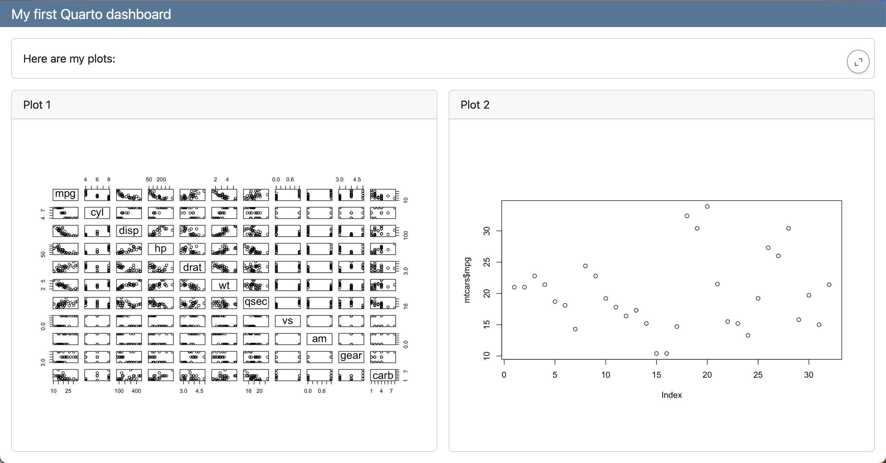
:::

::::

## Headings {auto-animate=true}

Continue adding content:

:::: {.columns}

::: {.column width="40%"}

````{.yaml filename="dashboard.qmd" code-line-numbers=24-27}
---
title: "My first Quarto dashboard"
format: 
  dashboard:
    orientation: rows
---

## Row

Here is my dashboard:

## Row

```{{r}}
#| title: "Plot 1"
plot(mtcars)
```

```{{r}}
#| title: "Plot 2"
plot(mtcars$mpg)
```

```{{r}}
#| title: "Plot 3"
plot(mtcars$hp)
```
````
:::

::: {.column width="60%"  .fragment}
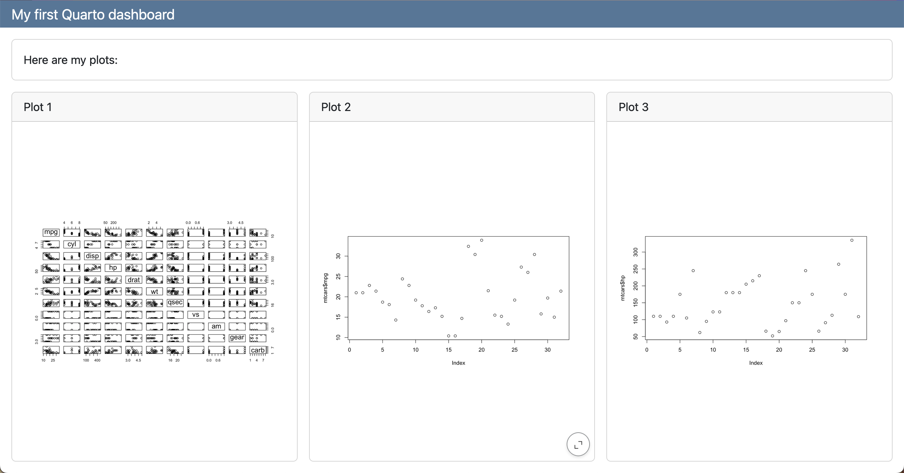
:::

::::

## Headings {auto-animate=true}

We can add columns within our rows:

:::: {.columns}

::: {.column width="40%"}

````{.yaml filename="dashboard.qmd" code-line-numbers=14,26}
---
title: "My first Quarto dashboard"
format: 
  dashboard:
    orientation: rows
---

## Row

Here is my dashboard:

## Row

### Column

```{{r}}
#| title: "Plot 1"
plot(mtcars)
```

```{{r}}
#| title: "Plot 2"
plot(mtcars)
```

### Column

```{{r}}
#| title: "Plot 3"
plot(mtcars)
```
````
:::

::: {.column width="60%"  .fragment}
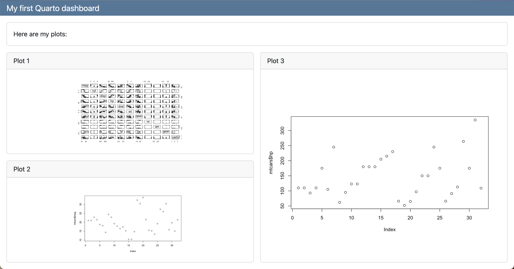
:::

::::

## Tabsets {auto-animate=true}

Or use tabsets to put content in different tabs:

:::: {.columns}

::: {.column width="40%"}

````{.yaml filename="dashboard.qmd" code-line-numbers=14}
---
title: "My first Quarto dashboard"
format: 
  dashboard:
    orientation: rows
---

## Row

Here is my dashboard:

## Row

### Column {.tabset}

```{{r}}
#| title: "Plot 1"
plot(mtcars)
```

```{{r}}
#| title: "Plot 2"
plot(mtcars$mpg)
```

### Column

```{{r}}
#| title: "Plot 3"
plot(mtcars$hp)
```
````
:::

::: {.column width="60%" .fragment}
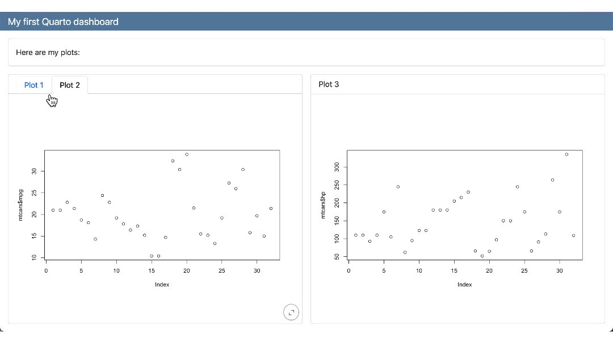
:::

::::

## Tabsets {auto-animate=true}

{fig-align="center"}

## Pages {auto-animate=true}

Use a Level 1 heading to create new pages:

:::: {.columns}

::: {.column width="40%"}

````{.yaml filename="dashboard.qmd" code-line-numbers=12,24}
---
title: "My first Quarto dashboard"
format: 
  dashboard:
    orientation: rows
---

## Row

Here is my dashboard:

# Page 1

```{{r}}
#| title: "Plot 1"
plot(mtcars)
```

```{{r}}
#| title: "Plot 2"
plot(mtcars$mpg)
```

# Page 2

```{{r}}
#| title: "Plot 3"
plot(mtcars$hp)
```
````

:::

::: {.column width="60%"  .fragment}
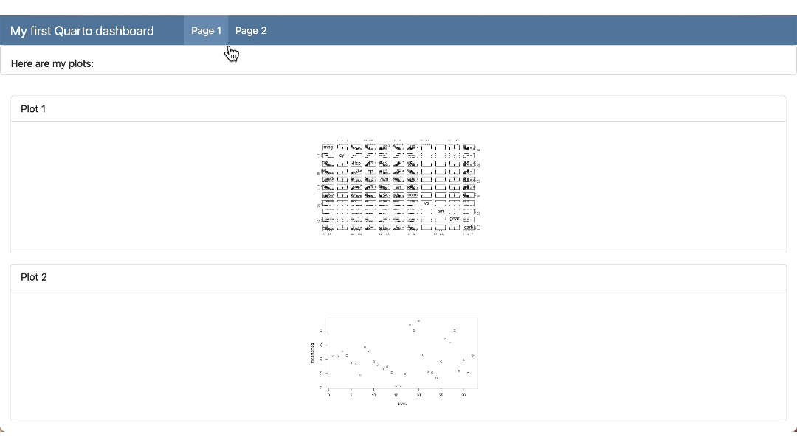
:::

::::

## Pages {auto-animate=true}

Use a Level 1 heading to create new pages:

{fig-align="center"}

## Navigation {auto-animate=true}

Add a logo and buttons to your navigation bar:

````{.yaml filename="dashboard.qmd" code-line-numbers=|5|6-9}
---
title: "My first Quarto dashboard"
format: 
  dashboard:
    logo: images/car.png
    nav-buttons:
      - reddit
      - icon: gitlab
        href: https://gitlab.com/ivelasq
---

## Row

Here is my dashboard:

# Page 1

```{{r}}
#| title: "Plot 1"
plot(mtcars)
```

```{{r}}
#| title: "Plot 2"
plot(mtcars$mpg)
```

# Page 2

```{{r}}
#| title: "Plot 3"
plot(mtcars$hp)
```
````

## Navigation {auto-animate=true}

Add a logo and buttons to your navigation bar:

:::: {.columns}

::: {.column width="40%"}

````{.yaml filename="dashboard.qmd"}
---
title: "My first Quarto dashboard"
format: 
  dashboard:
    logo: images/car.png
    nav-buttons:
      - reddit
      - icon: gitlab
        href: https://gitlab.com/
---

## Row

Here is my dashboard:

# Page 1

```{{r}}
#| title: "Plot 1"
plot(mtcars)
```

```{{r}}
#| title: "Plot 2"
plot(mtcars$mpg)
```

# Page 2

```{{r}}
#| title: "Plot 3"
plot(mtcars$hp)
```
````

:::

::: {.column width="60%"}
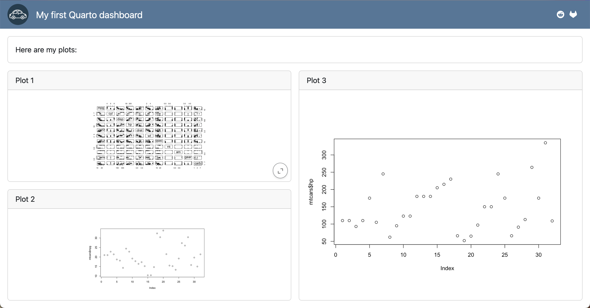
:::
::::

## Navigation {auto-animate=true}

{fig-align="center"}

::: footer
See more options: <https://quarto.org/docs/reference/projects/websites.html#navbar>
:::

## Cards

::: {.r-fit-text}

Cards are the fundamental unit of display within dashboards.

::: {.r-hstack}
::: {data-id="box1" auto-animate-delay="0" style="background: #508AA8; width: 200px; height: 150px; margin: 10px; border: 3px solid #000;"}
:::

::: {data-id="box2" auto-animate-delay="0.1" style="background: #F52A32; width: 200px; height: 150px; margin: 10px; border: 3px solid #000;"}
:::

::: {data-id="box3" auto-animate-delay="0.2" style="background: #DC5618; width: 200px; height: 150px; margin: 10px; border: 3px solid #000;"}
:::
:::

:::

## Text

Cards can also have arbitrary markdown: 

```markdown
::: {.card}
This text will be displayed within a card
:::
```

Enclose the both the cell and the content in a .card div to include content alongside the output of a cell:

````{.markdown}

::: {.card}
```{{r}}
plot(mtcars)
```

Above is my plot.
:::
````

## Text

Content that is included at the top of a dashboard is considered leading content, and will be included as is with no card styling:

````{.yaml filename="dashboard.qmd" code-line-numbers=8}
---
title: "My first Quarto dashboard"
format: dashboard
---

## Row

Here is my dashboard:

## Row

```{{r}}
#| title: "Plot 1"
plot(mtcars)
```

```{{r}}
#| title: "Plot 2"
plot(mtcars$mpg)
```
````

## Plots {auto-animate=true}

Both interactive JavaScript-based plots and standard raster based plots are supported.

````{.yaml filename="dashboard.qmd" code-line-numbers=8-11}
---
title: "My first Quarto dashboard"
format: dashboard
---

## Row

```{{r}}
#| title: "Plot 1"
plot(mtcars)
```

```{{r}}
#| title: "Plot 2"
plot(mtcars$mpg)
```
````

## Plots {auto-animate=true}

Size plots in static dashboards using code chunk options:

````{.yaml filename="dashboard.qmd" code-line-numbers=10-11}
---
title: "My first Quarto dashboard"
format: dashboard
---

## Row

```{{r}}
#| title: "Plot 1"
#| fig-width: 5
#| fig-height: 4
plot(mtcars)
```

```{{r}}
#| title: "Plot 2"
plot(mtcars$mpg)
```
````

## Tables {auto-animate=true}

Produce tabular output within cards:

````{.yaml filename="dashboard.qmd" code-line-numbers=8-11}
---
title: "My first Quarto dashboard"
format: dashboard
---

## Row

```{{r}}
#| title: "Table 1"
mtcars |> tibble::as_tibble() |> dplyr::filter(cyl == 6)  |> gt::gt()
```

```{{r}}
#| title: "Plot 2"
plot(mtcars$mpg)
```
````

## Tables {auto-animate=true}

Produce tabular output within cards:

:::: {.columns}

::: {.column width="40%"}

````{.yaml filename="dashboard.qmd"}
---
title: "My first Quarto dashboard"
format: dashboard
---

## Row

```{{r}}
#| title: "Table 1"
mtcars |> tibble::as_tibble() |> dplyr::filter(cyl == 6)  |> gt::gt()
```

```{{r}}
#| title: "Plot 2"
plot(mtcars$mpg)
```
````

:::

::: {.column width="60%"}
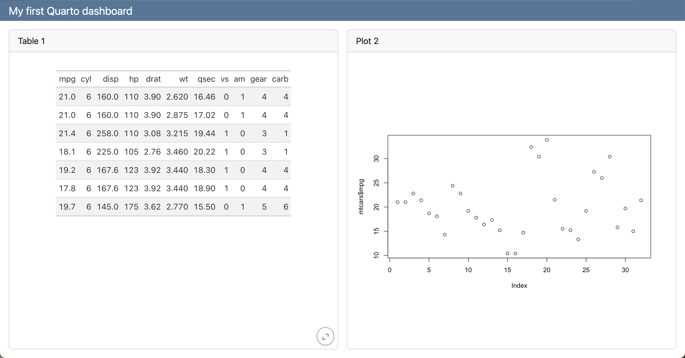
:::
::::

## Value Boxes {auto-animate=true}

Value boxes display simple values within a dashboard:

````{.yaml filename="dashboard.qmd" code-line-numbers=8-12|14-24}
---
title: "My first Quarto dashboard"
format: dashboard
---

## Row

::: {.valuebox color="#F52A32"}
Last updated:

`{{r}} Sys.Date()`
:::

```{{r}}
#| content: valuebox
#| title: "Spam per day"
n <- mtcars |> tibble::as_tibble() |> dplyr::count() |> dplyr::pull(n)

list(
  icon = "trash",
  color = "#F52A32",
  value = n
)
```

## Row

```{{r}}
#| title: "Plot 2"
plot(mtcars$mpg)
```
````

## Value Boxes {auto-animate=true}

:::: {.columns}

::: {.column width="40%"}

````{.yaml filename="dashboard.qmd" code-line-numbers=14-24}
---
title: "My first Quarto dashboard"
format: dashboard
---

## Row

::: {.valuebox color="#F52A32"}
Last updated:

`{r} Sys.Date()`
:::

```{{r}}
#| content: valuebox
#| title: "Spam per day"
n <- mtcars |> tibble::as_tibble() |> dplyr::count() |> dplyr::pull(n)

list(
  icon = "trash",
  color = "#F52A32",
  value = n
)
```

## Row

```{{r}}
#| title: "Plot 2"
plot(mtcars$mpg)
```
````
:::

::: {.column width="60%"}
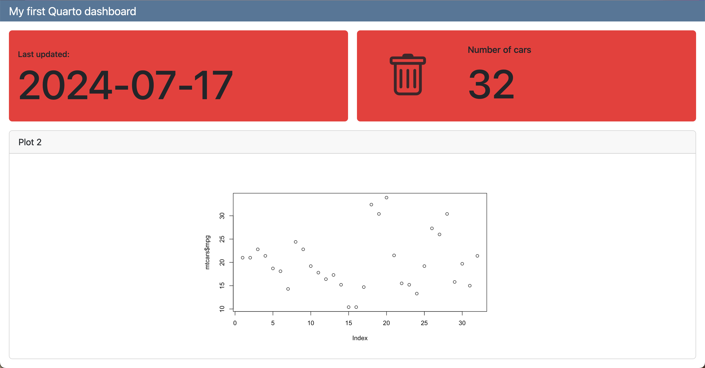
:::

::::

## Value Boxes {auto-animate=true}

{fig-align="center"}

## Input Layout

There are several ways to layout inputs within interactive dashboards:

::: incremental

* Sidebars provide a collapsible vertical panel for inputs.

* Toolbars provide a horizontal panel for inputs.

* Card Inputs provide a panel for card-specific inputs.

:::

## Input Layout

There are several ways to layout inputs within interactive dashboards:

* [Sidebars provide a collapsible vertical panel for inputs.]{style="color: red; background-color: #F5EACE;"}

* Toolbars provide a horizontal panel for inputs.

* Card Inputs provide a panel for card-specific inputs.

## Sidebars {auto-animate=true}

To include a sidebar, add the .sidebar class to a Level 2 heading:

````{.yaml filename="dashboard.qmd" code-line-numbers=6|6-8|10-12,32}
---
title: "My first Quarto dashboard"
format: dashboard
---

## {.sidebar}

Sidebar text here!

## Column

### Row

::: {.valuebox color="#F52A32"}
Last updated:

`{{r}} Sys.Date()`
:::

```{{r}}
#| content: valuebox
#| title: "Spam per day"
n <- mtcars |> tibble::as_tibble() |> dplyr::count() |> dplyr::pull(n)

list(
  icon = "trash",
  color = "#F52A32",
  value = n
)
```

### Row

```{{r}}
#| title: "Plot 2"
plot(mtcars$mpg)
```
````

## Sidebars {auto-animate=true}

To include a sidebar, add the .sidebar class to a Level 2 heading:

:::: {.columns}

::: {.column width="40%"}

````{.yaml filename="dashboard.qmd"}
---
title: "My first Quarto dashboard"
format: dashboard
---

## {.sidebar}

Sidebar text here!

## Column

### Row

::: {.valuebox color="#F52A32"}
Last updated:

`` `{r} Sys.Date()` ``
:::

```{{r}}
#| content: valuebox
#| title: "Spam per day"
n <- mtcars |> tibble::as_tibble() |> dplyr::count() |> dplyr::pull(n)

list(
  icon = "trash",
  color = "#F52A32",
  value = n
)
```

### Row

```{{r}}
#| title: "Plot 2"
plot(mtcars$mpg)
```
````

:::

::: {.column width="60%"}
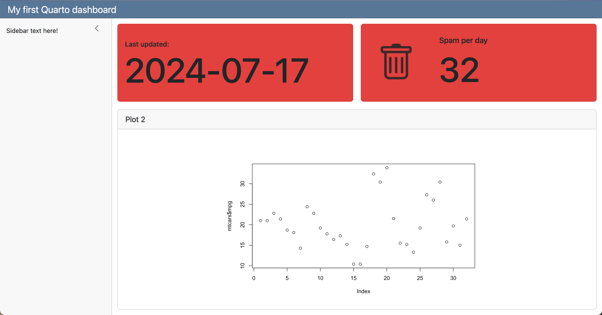
:::
::::

## Shiny

::: incremental
* The Shiny package provides an easy way to build web applications with R.
* Quarto dashboards can include embedded Shiny components (e.g. a plot with sliders that control its inputs) to add interactivity.
:::

## Non-interactive dashboard {auto-animate=true}

````{.yaml filename="dashboard.qmd" code-line-numbers=|8}
---
title: "Non-interactive Quarto dashboard"
format: 
  dashboard:
    orientation: rows
---

## {.sidebar}

## Column

### Row

Here is my dashboard:

### Row

```{{r}}
#| title: "Plot 2"
plot(mtcars$mpg)
```
````

## Non-interactive dashboard {auto-animate=true}

:::: {.columns}

::: {.column width="40%"}

````{.yaml filename="dashboard.qmd" code-line-numbers=|20}
---
title: "Non-interactive Quarto dashboard"
format: 
  dashboard:
    orientation: rows
---

## {.sidebar}

## Column

### Row

Here is my dashboard:

### Row

```{{r}}
#| title: "Plot 2"
plot(mtcars$mpg)
```
````
:::

::: {.column width="60%"}
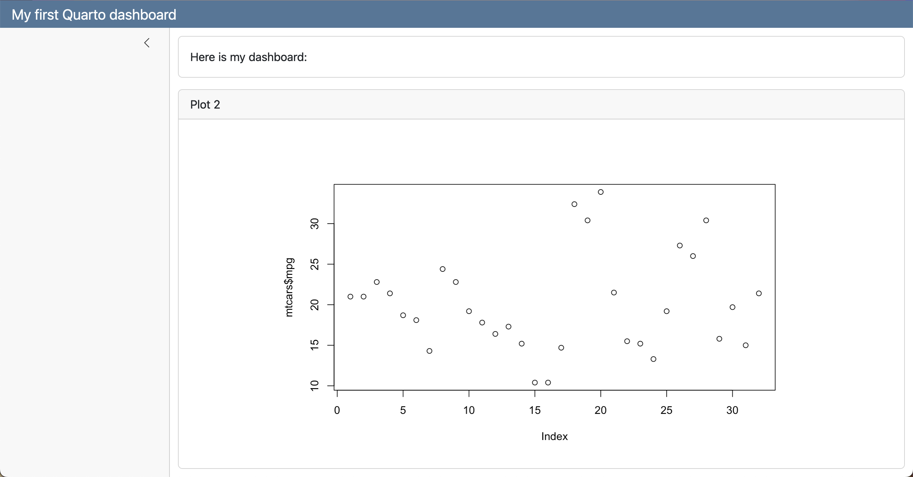
:::

::::

## Add Interactive Components {auto-animate=true}

````{.yaml filename="dashboard.qmd" code-line-numbers=|6|9-12|16-22|32-35|37-44}
---
title: "My first Quarto dashboard"
format: 
  dashboard:
    orientation: rows
server: shiny
---

```{{r}}
#| context: setup
library(ggplot2)
```

## {.sidebar}

```{{r}}
selectInput(
    "variableChoice",
    "Choose a variable:",
    choices = names(mtcars)
  )
```

## Column

### Row

Here is my dashboard:

### Row

```{{r}}
#| title: "Plot 2"
plotOutput("variablePlot")
```

```{{r}}
#| context: server

output$variablePlot <- renderPlot({
  yVar <- mtcars[[input$variableChoice]]
  plot(mtcars$index, yVar)
})
```
````

## Add Interactive Components {auto-animate=true}

:::: {.columns}

::: {.column width="40%"}

````{.yaml filename="dashboard.qmd"}
---
title: "My first Quarto dashboard"
format: 
  dashboard:
    orientation: rows
server: shiny
---

```{{r}}
#| context: setup
library(ggplot2)
```

## {.sidebar}

```{{r}}
selectInput(
    "variableChoice",
    "Choose a variable:",
    choices = names(mtcars)
  )
```

## Column

### Row

Here is my dashboard:

### Row

```{{r}}
#| title: "Plot 2"
plotOutput("variablePlot")
```

```{{r}}
#| context: server

output$variablePlot <- renderPlot({
  yVar <- mtcars[[input$variableChoice]]
  plot(mtcars$index, yVar)
})
```
````

:::

::: {.column width="60%"}
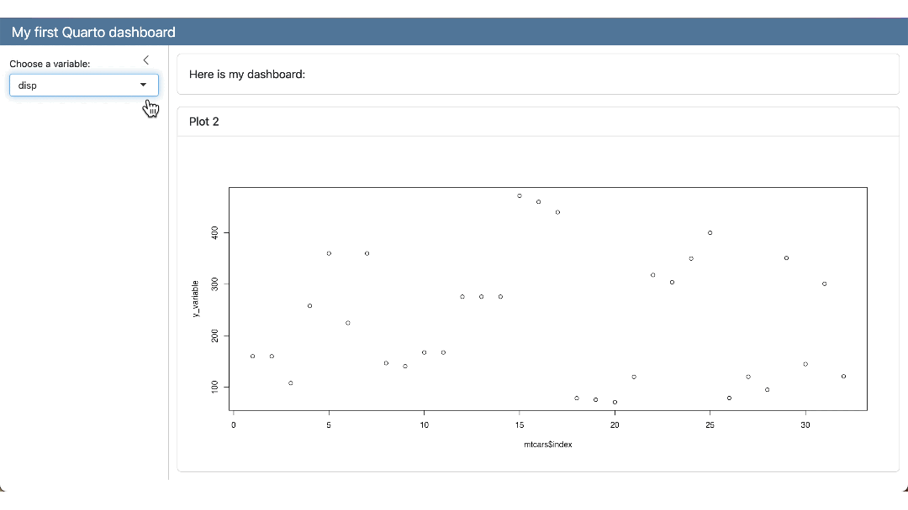
:::

::::

## Add Interactive Components {auto-animate=true}

{fig-align="center"}

## Your turn  {background-color=''}
  




::: footer
[Posit Cloud link: posit.cloud/content/12393384](posit.cloud/content/12393384)
:::
