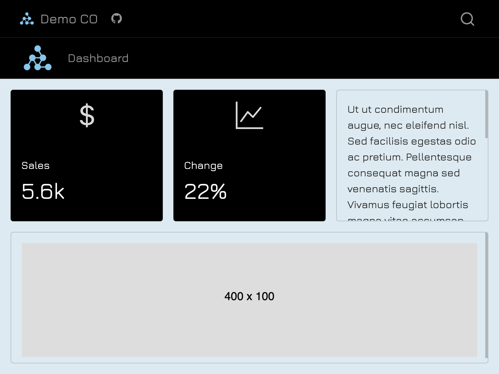
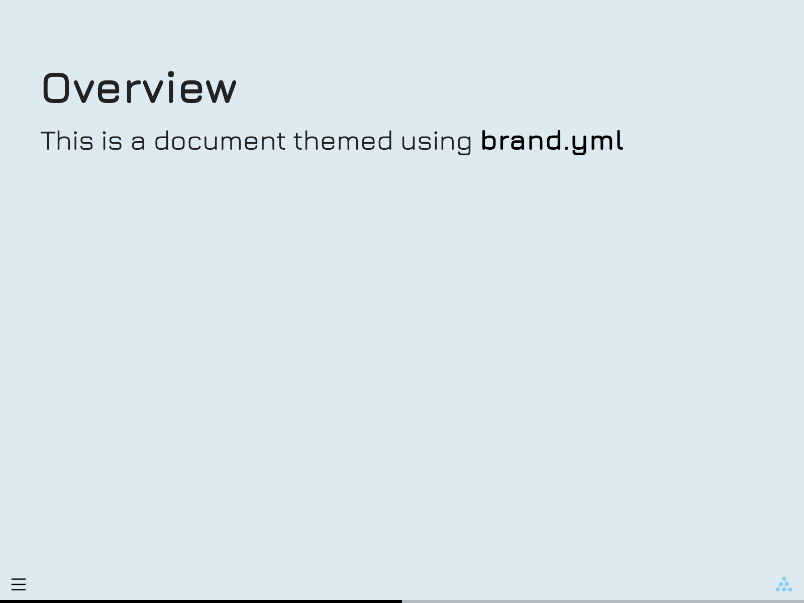
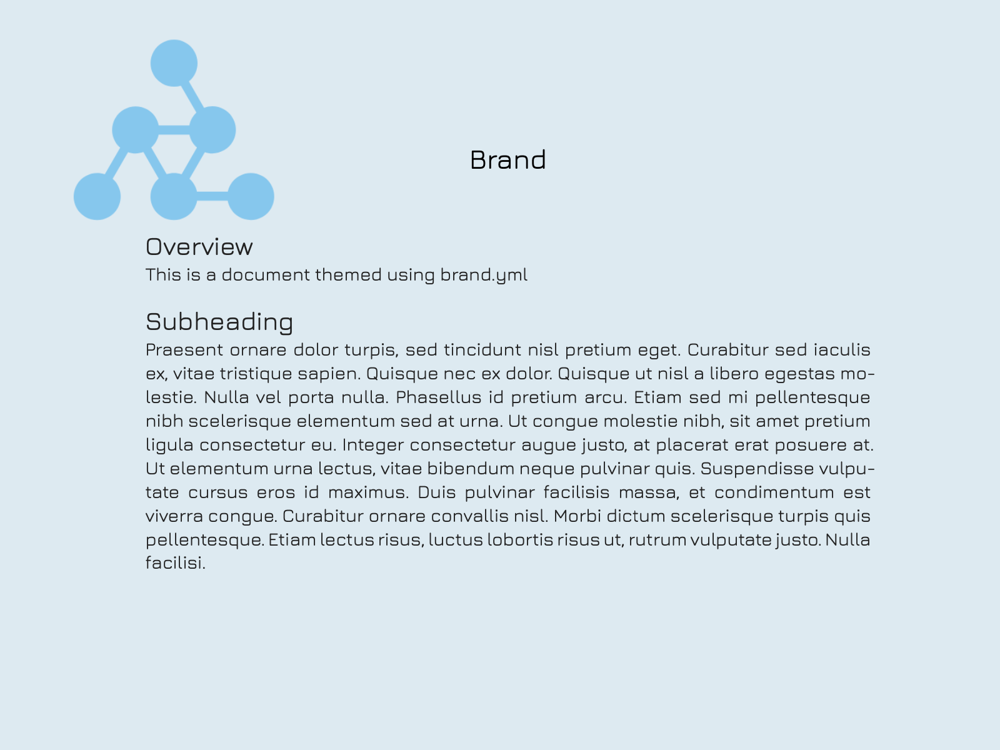
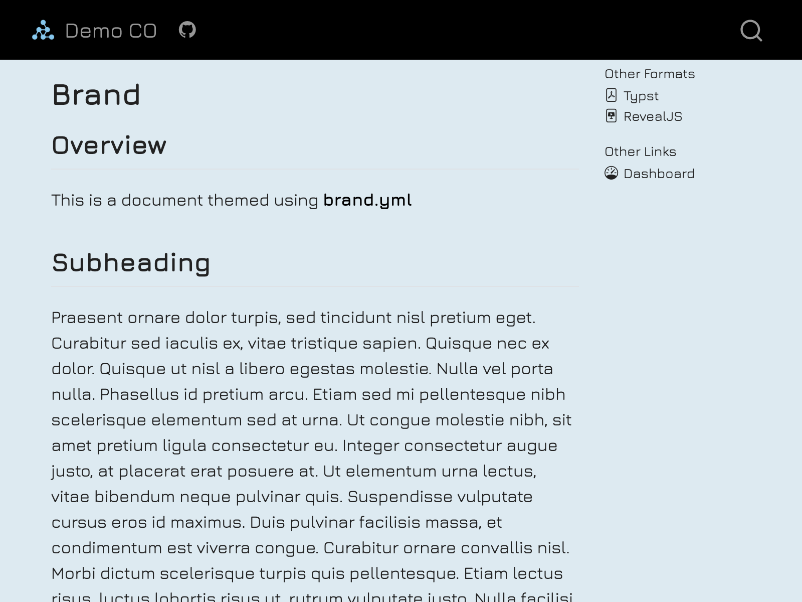
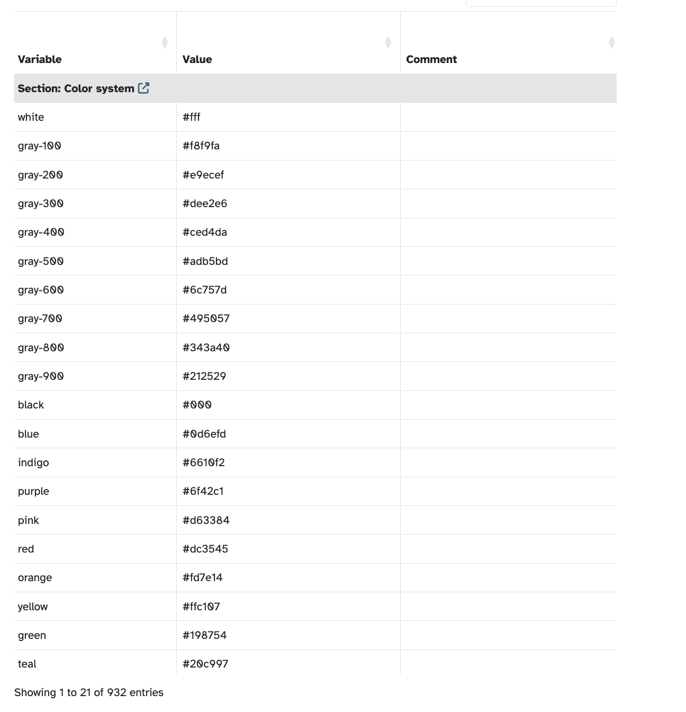
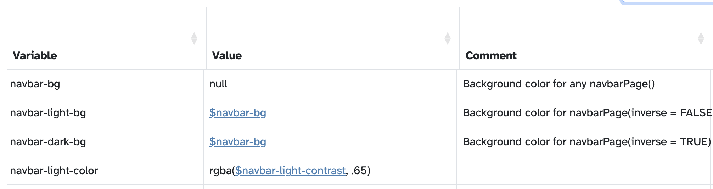

# Built-in themes

## HTML Theming {.scrollable}

Quarto includes 25 themes from the [Bootswatch](https://bootswatch.com/) project:

-   default
-   cerulean
-   cosmo
-   cyborg
-   darkly
-   flatly
-   journal
-   litera
-   lumen
-   lux
-   materia
-   minty
-   morph
-   pulse
-   quartz
-   sandstone
-   simplex
-   sketchy
-   slate
-   solar
-   spacelab
-   superhero
-   united
-   vapor
-   yeti
-   zephyr

## How to Apply HTML Theming

Provide the custom theme under `theme` in the YAML heading:

````{.markdown filename="my-document.qmd"}
---
theme:
  - flatly
---
````

# Introducing brand.yml

##

{fig-align="center" width="50%"}

Create reports, apps, dashboards, plots and more that match your company’s brand guidelines with a single `_brand.yml` file.

::: aside
[brand.yml documentation](https://posit-dev.github.io/brand-yml/), [Quarto documentation](https://quarto.org/docs/authoring/brand.html)
:::
::: notes
brand.yml is a simple, portable YAML file that codifies your company’s brand guidelines into a format that can be used by Quarto, Python and R tooling to create branded outputs. Our goal is to support unified, branded theming for all of Posit’s open source tools—from web applications to printed reports to dashboards and presentations—with a consistent look and feel.
:::

## brand.yml support

brand.yml is currently supported in:

* Quarto v1.6+
  * `html`, `dashboard`, `revealjs`, `typst`
* Shiny for Python v1.2
* R Markdown (with bslib v0.9.0)
* Shiny for R (with bslib v0.9.0)

## Quarto + brand.yml {.scrollable}

::: {layout-nrow=2}

{width="20%"}

{width="20%"}

{width="20%"}

{width="20%"}
:::

::: notes
Quarto offers the deepest integration with brand.yml. When you have a _brand.yml file in your project, Quarto automatically applies the branding across all these output formats: dashboards, Reveal.js slides, Typst documents, and standard HTML reports. It is the most seamless way to enforce brand consistency.
:::

## How to apply brand.yml

1. Define branding in a single` _brand.yml` file.
2. Save in the root directory of your Quarto project (alongside `_quarto.yml` if in a project)

Quarto will detect the presence of `_brand.yml` and automatically apply the brand to all documents of the supported formats in the project.

## brand.yml elements {auto-animate=true}

::: incremental

* `meta`: Identifying information, name of the company, URLs, etc.
* `logo`: Files or links to the brand’s logos.
* `color`: Colors in the brand's color palette. 
* `typography`: Fonts for different elements. 
* `defaults`: Additional context-specific settings.

:::

::: notes
A _brand.yml file is organized into these five key sections. Think of them as the building blocks of our brand identity. Everything is optional, so you can make this file as simple or as complex as your needs require. We'll walk through each one.
:::

## {auto-animate=true}

```{.yaml filename="_brand.yml"}
meta:

logo:

color:

typography:

defaults:
```

::: notes
This is what a blank slate looks like—just the main keys.
:::

## {auto-animate=true}

```{.yaml code-line-numbers="|1-3|5-8|10-18|20-26" filename="_brand.yml"}
meta:
  name: Acme Corporation
  link: https://www.acmecorp.com

logo:
  small: logos/icon.png
  medium: logos/header-logo.png
  large: logos/full-logo.svg

color:
  palette:
    white: "#FFFFFF"
    black: "#151515"
    blue: "#447099"

  foreground: black
  background: white
  primary: blue

typography:
  base:
    family: Open Sans
  headings:
    family: Roboto Slab
  monospace:
    family: Fira Code
```

::: notes
Now, a quick peek at a fully populated example. You might be wondering, "What is YAML?" It stands for "YAML Ain't Markup Language." It's essentially a simple data serialization format that uses easy-to-read key-value pairs to represent structured data. This example shows how we define metadata, link to our logos, set our color palette and theme colors, and specify our fonts. It’s all about structure and clarity.
:::

## Metadata {auto-animate=true}

```{.yaml}
meta:
  name: Acme Corporation
  link: https://www.acmecorp.com
```

::: notes
The meta section is for key identity information. This is where you put things like the company name, links to brand guidelines, and so on. Here’s a minimal example. Right now, Quarto doesn’t use these values to change the visual output—they’re mostly just for reference for people looking at the file.
:::

::: footer
[brand.yml metadata documentation](https://posit-dev.github.io/brand-yml/brand/meta.html)
:::

## Metadata {auto-animate=true}

```{.yaml code-line-numbers="3-5"}
meta:
  name: Acme Corporation
  link: 
    home: https://www.acmecorp.com
    github: https://github.com/acmecorp
```

::: notes
You can also make the links more detailed, adding things like links to your company’s social media or GitHub repos.
:::

::: footer
[brand.yml metadata documentation](https://posit-dev.github.io/brand-yml/brand/meta.html)
:::

## Metadata {auto-animate=true}

```{.yaml code-line-numbers="5-12|2,3,4"}
meta:
  name:
    full: Acme Corporation International
    short: Acme
  link:
    home: https://www.acmecorp.com
    docs: https://docs.acmecorp.com
    github: https://github.com/acmecorp
    bluesky: https://bsky.app/profile/acmecorp.bsky.social
    twitter: https://twitter.com/acmecorp
    linkedin: https://www.linkedin.com/company/acmecorp
    facebook: https://www.facebook.com/acmecorp
  description: |
    Acme Corporation is a leading provider of innovative solutions for cartoon
    characters worldwide.
  founded: 1952
```

::: footer
[brand.yml metadata documentation](https://posit-dev.github.io/brand-yml/brand/meta.html)
:::

::: notes
And here’s an example with even more detail. You can provide a full and short version of the name, a longer description, and even the founding year. Again, all of this helps centralize that key brand information.
:::

## Logo {auto-animate=true}

```{.yaml}
logo: logo.png
```

::: notes
The logo field is straightforward. You use it to specify your brand’s logo at various sizes. You can simply provide a path to a local file, relative to the _brand.yml file, or use a URL. The key is that this system is flexible enough to handle different logo sizes and even light/dark mode variants.
:::

::: footer
[brand.yml logo documentation](https://posit-dev.github.io/brand-yml/brand/logo.html)
:::

## Logo {auto-animate=true}

```{.yaml code-line-numbers="|2|3|4"}
logo:
  small: logos/icon.png
  medium: logos/header-logo.png
  large: logos/full-logo.svg
```

::: footer
[brand.yml logo documentation](https://posit-dev.github.io/brand-yml/brand/logo.html)
:::

::: notes
It’s best practice to define logos for different contexts. The small logo is for tiny displays, like favicons or mobile icons. The medium one is usually for website headers or navigation bars. And the large logo is for bigger contexts, like a title slide for a presentation.
:::

## Logo {auto-animate=true}

```{.yaml code-line-numbers="|4|5"}
logo:
  small: logos/icon.png
  medium:
    light: logos/header-logo.png
    dark: logos/header-logo-white.png
  large: logos/full-logo.svg
```

::: footer
[brand.yml logo documentation](https://posit-dev.github.io/brand-yml/brand/logo.html)
:::

::: notes
If you need to support dark mode, you can specify different logo versions. Here, for the medium size, we have a light version for light backgrounds and a dark version for dark backgrounds.
:::

## Logo {auto-animate=true}

```{.yaml code-line-numbers="|4,9"}
logo:
  images:
    icon: logos/icon.png
    header: logos/header-logo.png
    header-white: logos/header-logo-white.png
    full: logos/full-logo.svg
  small: icon
  medium:
    light: header
    dark: header-white
  large: full
```

::: footer
[brand.yml logo documentation](https://posit-dev.github.io/brand-yml/brand/logo.html)
:::

::: notes
Use images as a nested mapping to define multiple logo resources with meaningful names. Then, you can directly reference these resources by name in the small, medium, and large attributes.
:::

## Logo {auto-animate=true}

```{.yaml code-line-numbers="|5,8,11,14"}
logo:
  images:
    icon:
      path: logos/icon.png
      alt: "Company icon with abstract shapes"
    header:
      path: logos/header-logo.png
      alt: "Company name with logo"
    header-white:
      path: logos/header-logo-white.png
      alt: "Company name with logo in white"
    full:
      path: logos/full-logo.svg
      alt: "Full company logo with tagline"
  small: icon
  medium:
    light: header
    dark: header-white
  large: full
```

::: footer
[brand.yml logo documentation](https://posit-dev.github.io/brand-yml/brand/logo.html)
:::

::: notes
And finally, a crucial step for accessibility: you can and should include alternative text for your logo images. By adding the alt property, you ensure that screen readers can convey the image's purpose to users who are visually impaired. This is a great way to ensure we meet accessibility guidelines right from the source.
:::

## Colors {auto-animate=true}

```{.yaml}
color:
  palette:
    black: "#1C2826"
    blue: "#0C0A3E" 
    neutral: "#F9F7F1" 
    red: "#BA274A"
    violet: "#4D6CFA"
```

::: footer
[brand.yml color documentation](https://posit-dev.github.io/brand-yml/brand/color.html)
:::

::: notes
Next up is the color section, which is vital for theming. It has two main parts. The first part, the palette, is a set of named colors specific to our brand. We define each color with an easy-to-read name—like blue or red—and then map it to its specific hex code. This lets us refer to them by name, which is much easier than memorizing the hex codes!
:::

## Colors {auto-animate=true}

```{.yaml}
color:
  . . .
  
  foreground: black # Main text color
  background: white # Main background color
  primary: blue # Primary accent color, used for hyperlinks, etc.
  secondary: "#707073" # Secondary accent color, often used for lighter text
  tertiary: "#C2C2C4" # Tertiary accent color
  success: green # Color used for positive or successful actions
  info: teal # Color used for neutral or informational actions
  warning: orange # Color used for warning or cautionary actions
  danger: burgundy # Color used for errors, dangerous actions
  light: white # Bright color, used as a high-contrast foreground color
  dark: "#404041" # Dark color, used as a high-contrast foreground color
```

::: footer
[brand.yml color documentation](https://posit-dev.github.io/brand-yml/brand/color.html)
:::

::: notes
The second part is where we assign our brand colors to theme colors, giving them a semantic role. This is how Quarto and Shiny know what to do. For example, we map a brand color to primary, which is the color used for key elements like buttons and hyperlinks. We also set colors for things like success, warning, and danger. Notice how we can use the names from the palette or just use a hex code directly.
:::

## Colors {auto-animate=true}

```{.yaml code-line-numbers="|5,13"}
color:
  palette:
    white: "#FFFFFF"
    black: "#151515"
    blue: "#447099"
    orange: "#EE6331"
    green: "#72994E"
    teal: "#419599"
    burgundy: "#9A4665"

  foreground: black
  background: white
  primary: blue
  secondary: "#707073"
  tertiary: "#C2C2C4"
  success: green
  info: teal
  warning: orange
  danger: burgundy
  light: white
  dark: "#404041"
```

::: footer
[brand.yml color documentation](https://posit-dev.github.io/brand-yml/brand/color.html)
:::

::: notes
This is the full section, showing both the palette and the theme assignments. This is what we mean by defining it once: we have our official colors, and we map them to the system roles, guaranteeing brand consistency everywhere.
:::

## Colors {auto-animate=true}

```{.yaml}
color:
  foreground: "#151515"
  background: "#FFFFFF"
  primary: "#447099"
  secondary: "#707073"
  tertiary: "#C2C2C4"
  success: "#72994E"
  info: "#419599"
  warning: "#EE6331"
  danger: "#9A4665"
  light: "#FFFFFF"
  dark: "#404041"
```

::: footer
[brand.yml color documentation](https://posit-dev.github.io/brand-yml/brand/color.html)
:::

::: notes
Just to be clear, if you want to keep it simple, you can skip the brand color palette entirely and just assign the hex codes directly to the theme colors. It's a quick way to get your branding applied, though defining the palette gives you more flexibility later on.
:::

## Typography {auto-animate=true}

```{.yaml}
typography:
  base: Open Sans
  headings: Roboto Slab
  monospace: Fira Code
```

::: notes
The typography element is where we handle fonts and their styles. At the most minimal level, you can simply list the fonts for your base (or body) text, headings (like titles and section names), and monospace text (which is typically used for code).
:::

::: footer
[brand.yml typography documentation](https://posit-dev.github.io/brand-yml/brand/typography.html)
:::

## Typography {auto-animate=true}

```{.yaml}
typography:
  base:
    family: Open Sans
  headings:
    family: Roboto Slab
  monospace:
    family: Fira Code
```

::: footer
[brand.yml typography documentation](https://posit-dev.github.io/brand-yml/brand/typography.html)
:::

::: notes
This format, specifying the family under each section, is a bit more explicit and is equivalent to the previous slide.
:::

## Typography {auto-animate=true}

```{.yaml}
typography:
  fonts:
    - family: Open Sans
      source: google
    - family: Roboto Slab
      source: google
    - family: Fira Code
      source: google
```

::: footer
[brand.yml typography documentation](https://posit-dev.github.io/brand-yml/brand/typography.html)
:::

::: notes
When we’re dealing with web outputs, we need to make sure the fonts are available. If you're using fonts from an online source like Google Fonts, you should define the font sources in the fonts section like this. This tells Quarto and Shiny where to fetch the files so users don’t need the fonts installed locally.
:::

## Typography {auto-animate=true}

```{.yaml code-line-numbers="|4,6,8"}
typography:
  fonts:
    - family: Open Sans
      source: bunny
    - family: Roboto Slab
      source: bunny
    - family: Fira Code
      source: bunny
```

::: footer
[brand.yml typography documentation](https://posit-dev.github.io/brand-yml/brand/typography.html)
:::

::: notes
A neat little detail is that you can also specify bunny as the source. Bunny Fonts is a GDPR-compliant alternative to Google Fonts, which can be important for certain data compliance requirements.
:::

## Typography {auto-animate=true}

```{.yaml code-line-numbers="|3-9"}
typography:
  fonts:
    # Local files
    - family: Open Sans
      source: file
      files:
        - path: fonts/open-sans/OpenSans-Variable.ttf
        - path: fonts/open-sans/OpenSans-Variable-Italic.ttf
          style: italic
    # Online files
    - family: Closed Sans
      source: file
      files:
        - path: https://example.com/Closed-Sans-Bold.woff2
          weight: bold
        - path: https://example.com/Closed-Sans-Italic.woff2
          style: italic
```

::: footer
[brand.yml typography documentation](https://posit-dev.github.io/brand-yml/brand/typography.html)
:::

::: notes
If your brand uses proprietary or custom fonts, you can include them locally. You set the source to file and then list each font file with its path and specific style or weight. This ensures we can use even our most specific brand fonts.
:::

## Typography {auto-animate=true}

```{.yaml code-line-numbers="|9-12"}
typography:
  fonts:
    - family: Open Sans
      source: google
    - family: Roboto Slab
      source: google
    - family: Fira Code
      source: google
  base: Open Sans #  Font and appearance settings for the base (body) text
  headings: Roboto Slab #  Font and appearance settings for heading text
  monospace: Fira Code # Font and appearance settings for monospaced text 
  link: Fira Code   #Font and appearance settings for hyperlink text
```

::: notes
Once the fonts are defined, we map them to the different text elements. You can see here how we set a font for link text as well. This is how we specify which font to use for what purpose.
:::

::: footer
[brand.yml typography documentation](https://posit-dev.github.io/brand-yml/brand/typography.html)
:::

## Typography {auto-animate=true}

```{.yaml code-line-numbers="|4,5|8"}
. . .
  base:
    family: Open Sans
    line-height: 1.25
    size: 1rem
  headings:
    family: Roboto Slab
    color: primary
    weight: 600
  monospace:
    family: Fira Code
    size: 0.9em
```

::: footer
[brand.yml typography documentation](https://posit-dev.github.io/brand-yml/brand/typography.html)
:::

::: notes
But we can go deeper! Beyond just the font family, we can specify styling details like the text size, line-height, and font weight. Crucially, you can also use one of your defined theme colors for text, like setting the heading color to primary. This links the typography and color sections for a completely cohesive style.
:::

## Defaults

{fig-align="center" style="box-shadow: 5px 5px 15px rgba(0, 0, 0, 0.3); border-radius: 5px;"}

::: footer
[Bootstrap CSS Classes](https://bootstrapshuffle.com/classes) | [bslib theming variables](https://rstudio.github.io/bslib/articles/bs5-variables/index.html)
:::

## bslib + Defaults

{fig-align="center" style="box-shadow: 5px 5px 15px rgba(0, 0, 0, 0.3); border-radius: 5px;"}

. . .

```{.yaml filename="_brand.yml"}
defaults:
  bootstrap:
    defaults:
      navbar-bg: $brand-dark-blue
```

::: notes
The real magic of using them together is when you need highly customized, specific use cases. You get the benefit of the consistent branding from brand.yml, but you can still access and modify specific Bootstrap variables for fine-tuning. For example, if we want the navigation bar background to be a very specific shade of blue that's defined in our brand colors, we can set that specific Bootstrap variable right in the defaults section of our _brand.yml.
:::

::: footer
[Defaults documentation](https://posit-dev.github.io/brand-yml/brand/defaults.html)
:::

# Using brand.yml with Quarto

## Using `_brand.yml` shortcodes

```{.md filename="document.qmd"}
{}
```



<br>

```{.md filename="document.qmd"}
## Slide Title {background-color='{}'} 
```

::: notes
Beyond automatic application, Quarto lets you directly access the values in your _brand.yml file using shortcodes. In the first example, you can call a specific logo file by name right in your markdown. In the second example, you can directly set the background color of a slide to your primary brand color. This allows for dynamic branding. Currently, this works for logos and colors, but not typography, meta, or defaults.
:::

::: footer
[Multiformat branding with` _brand.yml`](https://quarto.org/docs/authoring/brand.html)
:::


## Other ways of applying brand.yml

If your brand file has a different name or lives in a subdirectory, use the `brand` key.

```{.markdown  filename="report.qmd" code-line-numbers=4}
---
title: "Phase III Trial Summary for Novel Oncology Agent (Drug X)"
format: html
brand: org_theme.yml
---
```

## Disable brand.yml

To turn off brand.yml for a document, use `brand: false`.

```{.markdown  filename="report.qmd" code-line-numbers=4}
---
title: "Phase III Trial Summary for Novel Oncology Agent (Drug X)"
format: html
brand: false
---
```

## Your turn {background-color=''}



