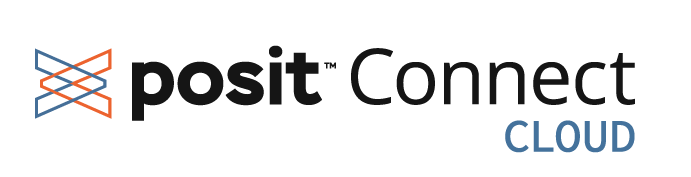

## Publishing options

Quarto documents are typically just static HTML pages so can be deployed to any web server or web host.

-   [Posit Connect Cloud](https://connect.posit.cloud/)
-   [GitHub Pages](https://pages.github.com/)
-   [Quarto Pub](https://quartopub.com/)
-   [Posit Connect](https://posit.co/products/enterprise/connect/)

::: aside
[Publishing Quarto documentation](https://quarto.org/docs/publishing/)
:::

## Posit Connect Cloud

{fig-align="center"}

[https://connect.posit.cloud/](https://connect.posit.cloud/)

Easily publish and share data applications and documents in a cloud environment within minutes.

## Our turn {background-color=''}



